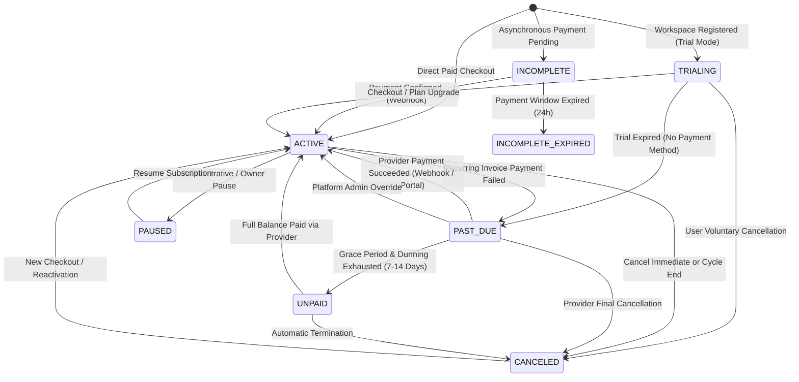

# Phase 1.15 SaaS Billing & Subscriptions — Architecture Specification

> **Document Status**: LOCKED FOR IMPLEMENTATION (Phase 1.15 Architecture Standard)  
> **Domain**: SaaS Platform Monetization — Subscriptions, Plans, Pricing Tiers, Entitlement Resolution, Quota Enforcement, Provider Abstraction (Stripe/Mock), Webhook Ingestion & Idempotency, Proration, Dunning & Reconciliation  
> **Dependencies**: Phase 1.1 (Multi-Tenancy & Workspace Partitioning), Phase 1.2 (Authentication & RBAC), Phase 1.3 (Technicians & Organization), Phase 1.13 (Notifications & Event Dispatch), Phase 1.14 (Reporting & Metrics Isolation)  
> **Target Service & API Implementation**: Phase 1.15.2 – Phase 1.15.10  
> **Out of Scope (Named Explicitly)**: Phase 1.12 (Tenant Invoicing & End-Customer Payments), Phase 1.16 (Automations & Workflows), Phase 1.17 (Third-Party Integrations), Phase 1.19 (Platform Super-Admin Operator UI / Admin REST Endpoints — *underlying internal services are built here in 1.15.4/1.15.5, but operator REST routes are deferred to 1.19*), Phase 1.23 (Web App Frontend UI / Portal Views)

---

## Executive Summary

Phases 1.1 through 1.14 established Aforden's multi-tenant core, field service operational systems (Work Orders, Assets, Scheduling, Mobile Field Execution, Inventory, Quotes, Field Invoicing), multi-channel notification engine, and read-only cross-domain reporting analytics.

Phase 1.15 introduces **SaaS Billing & Subscriptions**: the platform monetization domain through which Aforden licenses its software to tenant organizations (Workspaces). It governs subscription lifecycles, pricing plans, seat counting, tiered feature entitlements, quota guard middleware, external payment provider integration (Stripe & Mock adapters), idempotent webhook processing, dunning and suspension mechanics, and provider state reconciliation.

This document serves as the binding architectural contract for Phase 1.15. Twelve foundational decisions define it:

1. **The Invoicing Disambiguation Invariant**: Phase 1.12 (`Invoice`, `Payment`) invoices *our users' customers* for field services. Phase 1.15 (`SubscriptionInvoice`, `SubscriptionPayment`) bills *our users (Tenants)* for the Aforden platform. These two data models share zero tables, zero routes, zero calculation engines, and zero identifiers.
2. **Provider Abstraction & Aforden ID Sovereignty**: Aforden assigns and owns all internal entity UUIDs (`SubscriptionId`, `PlanId`, `BillingAccountId`, `SubscriptionInvoiceId`, `SubscriptionPaymentId`). Stripe customer/subscription/payment IDs are stored strictly as secondary reference attributes. Aforden's domain logic never uses third-party provider IDs as primary keys, ensuring provider interchangeability, offline testing, and multi-gateway extensibility.
3. **Provider-Driven State Recovery**: The transition `PAST_DUE → ACTIVE` is provider-driven via idempotent webhook reconciliation (`invoice.payment_succeeded`, `customer.subscription.updated`) or background reconciliation sync. Tenant actions (e.g. updating payment methods) redirect through provider sessions, and local subscription state transitions automatically upon receiving provider confirmation.
4. **Three-Tier Entitlement Resolution Hierarchy**: Entitlement resolution follows a strict precedence:
   $$\text{Resolved Limit} = \text{Workspace Override} \succ \text{Plan Limit} \succ \text{System Default Fallback}$$
   Custom enterprise seat grants, grandfathered quotas, or promotional modules are resolved dynamically via `WorkspaceEntitlementOverride` without mutating canonical `SubscriptionPlan` definitions.
5. **Generic Dynamic Seat Scaling Semantics**: Quotas that scale with seat counts declare `scalesWithSeats: true` on `SubscriptionPlanFeature`. For such features, `valueJson` is strictly defined and validated as a **positive integer per-seat multiplier** ($m \ge 1$, e.g. `1` member per purchased seat). The resolver validates this coefficient at runtime and computes `resolvedValue = multiplier * subscription.seatsCount`.
6. **Strict Tenant Foreign Key Integrity**: All tenant-scoped billing models (`PlatformBillingAccount`, `Subscription`, `SubscriptionInvoice`, `SubscriptionPayment`, `WorkspaceEntitlementOverride`) maintain direct, enforced `@relation` foreign keys to `Workspace(id)`.
7. **Single Active Subscription Invariant**: A workspace/account may have at most one active or non-terminal subscription at any time, enforced dual-layer via PostgreSQL partial unique index and transactional service-layer checks.
8. **Transactional Webhook Inbox & Idempotent Processing**: Webhooks land in a durable `BillingWebhookEvent` inbox table after cryptographic HMAC signature verification. Events are processed with idempotent deduplication keys (`provider + "_" + eventId`) and strict out-of-order sequence timestamp guards.
9. **Deterministic Proration & Downgrade Safety**: Plan upgrades apply immediately with provider-calculated prorations. Plan downgrades or cancellations are scheduled for the end of the current billing period (`cancelAtPeriodEnd = true`) to prevent premature revocation of paid operational capacity.
10. **Dunning Engine & Layered Access Degradation**: Failed recurring payments trigger a 7-day operational grace period (`PAST_DUE`) with warning notifications, progressing to soft suspension (read-only mode / blocking entity creation), and ultimately hard suspension/cancellation upon dunning exhaustion.
11. **Notification Integration via Phase 1.13 Outbox**: Billing lifecycle events (`billing.payment_failed`, `billing.subscription_canceled`, `billing.trial_expiring`, `billing.dunning_warning`) emit strongly typed events into the Phase 1.13 `NotificationOutbox` inside the triggering database transaction.
12. **Locked 10-Stage Implementation Roadmap**: The subphase sequence is frozen (1.15.1 through 1.15.10), superseding earlier preliminary 13-stage drafts.

---

```
+-----------------------------------------------------------------------------------------------------------------------+
|                                                  WORKSPACE (Tenant)                                                   |
|                                                                                                                       |
|  OPERATIONAL SERVICES (Phases 1.2 - 1.10)                     SAAS BILLING & MONETIZATION (Phase 1.15)                 |
|  +---------------------------------------+                    +----------------------------------------------------+  |
|  | User / Member Service (Phase 1.2/1.3) |                    | Entitlement Engine & Quota Guards (1.15.5)         |  |
|  | - inviteMember()                      |-- assertQuota ---->| - assertEntitlement(wsId, "MAX_MEMBERS")           |  |
|  | - activateTechnician()                |                    | - resolveEntitlement(wsId, "FEATURE_REPORTING")    |  |
|  +---------------------------------------+                    +-------------------------+--------------------------+  |
|                                                                                         |                             |
|  +---------------------------------------+                                              | reads plan & overrides      |
|  | Work Order Service (Phase 1.6)        |                                              v                             |
|  | - createWorkOrder()                   |-- assertQuota ---->+----------------------------------------------------+  |
|  +---------------------------------------+                    | Subscription Lifecycle Engine (1.15.4)             |  |
|                                                               | - status: ACTIVE | PAST_DUE | TRIALING | CANCELED  |  |
|                                                               | - plan: GROWTH_MONTHLY | ENTERPRISE                |  |
|                                                               | - seats: 12 (Base: 5, Additional: 7)               |  |
|                                                               +-------------------------+--------------------------+  |
|                                                                                         |                             |
|                                                                                         | interacts via Adapter       |
|                                                                                         v                             |
|  ===================================================================================================================  |
|  |                              BILLING PROVIDER GATEWAY ABSTRACTION (Phase 1.15.3)                                |  |
|  |                                                                                                                 |  |
|  |  +-----------------------------------------------------------------------------------------------------------+  |  |
|  |  |                                      BillingProviderAdapter (Interface)                                   |  |  |
|  |  |  createCustomer() | createCheckoutSession() | createPortalSession() | updateSubscription() | cancel()     |  |  |
|  |  +-------------------------------------+-------------------------------------+-------------------------------+  |  |
|  |                                        |                                     |                                 |  |
|  |                                        v                                     v                                 |  |
|  |                    +---------------------------------------+   +---------------------------------------+       |  |
|  |                    | StripeBillingAdapter (Production)     |   | MockBillingAdapter (Unit/Integration) |       |  |
|  |                    | - Stripe Node SDK (v17+)              |   | - In-Memory Deterministic Simulator   |       |  |
|  |                    | - Webhook Signature Verification      |   | - Instant Webhook Generator           |       |  |
|  |                    +---------------------------------------+   +---------------------------------------+       |  |
|  ===================================================================================================================  |
|                                           |                                                     ^                     |
|                                           | Inbound Webhooks                                    | API Calls           |
|                                           v                                                     |                     |
|  +------------------------------------------------------------------------------------+         |                     |
|  | Webhook Ingestion & Idempotency Inbox (1.15.8)                                     |         |                     |
|  | - Endpoint: POST /api/billing/webhooks/stripe                                      |         |                     |
|  | - HMAC Signature Check -> Deduplication -> BillingWebhookEvent Inbox Table         |         |                     |
|  | - State Transitions: invoice.payment_succeeded -> PAST_DUE => ACTIVE                |         |                     |
|  +------------------------------------------------------------------------------------+         |                     |
|                                           |                                                     |                     |
|                                           v                                                     |                     |
|  +------------------------------------------------------------------------------------+         |                     |
|  | Dunning & Grace Period Engine (1.15.9)                                              |         |                     |
|  | - Failed Payments -> 7-Day Grace Period -> Soft Degradation -> Hard Suspension      |---------+                     |
|  | - Emits Events to Phase 1.13 Notification Outbox (Email / In-App Alerts to Owner)  |                               |
|  +------------------------------------------------------------------------------------+                               |
+-----------------------------------------------------------------------------------------------------------------------+
```

---

## 1. Domain Boundaries & Separation of Concerns

### 1.1 Phase 1.12 vs Phase 1.15 Separation Matrix

| Architectural Dimension | Phase 1.12: Invoicing & Field Payments | Phase 1.15: SaaS Billing & Subscriptions |
| :--- | :--- | :--- |
| **Who is being billed?** | The **Customer** (the client receiving HVAC, plumbing, or electrical field service from the tenant). | The **Tenant / Workspace** (the field service company using the Aforden platform). |
| **Who issues the charge?** | The **Tenant** (via their field service staff, dispatchers, or automated work-order completion). | **Aforden Inc.** (the SaaS platform provider). |
| **Core Database Models** | `Invoice`, `InvoiceLineItem`, `Payment`, `InvoiceHistory`. | `PlatformBillingAccount`, `Subscription`, `SubscriptionPlan`, `SubscriptionInvoice`, `SubscriptionPayment`, `SubscriptionHistory`. |
| **Pricing Logic** | `invoiceCalculationEngine` (labor rates, part markup, local sales tax, field discounts). | `SubscriptionPlan` catalog, tiered seat prices, add-on feature modules, Stripe billing schedules. |
| **Payment Gateway Account** | Tenant's connected merchant account (or direct payment records: cash, check, ACH). | Aforden's platform Stripe account. |
| **State Machine** | `DRAFT → ISSUED → PARTIALLY_PAID → PAID / OVERDUE / VOID / WRITTEN_OFF`. | `TRIALING → ACTIVE → PAST_DUE → UNPAID → CANCELED / PAUSED`. |
| **RBAC Permissions** | `invoices.create`, `invoices.issue`, `payments.record`. | `billing.view_plan`, `billing.manage_subscription`, `billing.manage_payment_methods`. |

### 1.2 Domain Ownership Table

| Domain | Owns | Does NOT Own / Consumes |
| :--- | :--- | :--- |
| **SaaS Billing & Subscriptions** (Phase 1.15) | `PlatformBillingAccount`, `Subscription`, `SubscriptionPlan`, `SubscriptionPlanPrice`, `SubscriptionPlanFeature`, `WorkspaceEntitlementOverride`, `SubscriptionInvoice`, `SubscriptionPayment`, `BillingWebhookEvent`, `SubscriptionHistory`, `BillingProviderAdapter` interfaces, entitlement evaluation logic, dunning engine, and subscription reconciliation worker. | Does **NOT** own operational WorkOrders (Phase 1.6), does **NOT** own customer invoices (Phase 1.12), does **NOT** own member auth tokens (Phase 1.2), does **NOT** deliver emails/SMS directly (delegates to Phase 1.13). Operator UI/REST routes are deferred to Phase 1.19. |
| **Workspace & RBAC** (Phase 1.1 / 1.2 / 1.3) | `Workspace`, `WorkspaceMember`, `User`, `TechnicianProfile`. | Consumes `assertEntitlement()` before creating or activating new members/technicians. |
| **Notifications** (Phase 1.13) | `NotificationOutbox`, multi-channel delivery workers, email/in-app transports. | Consumes billing events (`billing.payment_failed`, `billing.trial_expiring`) emitted by Phase 1.15 services into the transactional outbox. |
| **Reporting & Analytics** (Phase 1.14) | Aggregation read models, operational/financial metric registries. | Phase 1.14 aggregates operational field data. Platform-level billing metrics (SaaS MRR, cohort churn, LTV) are isolated to system administration. |

---

## 2. Provider Abstraction Architecture (`BillingProviderAdapter`)

### 2.1 Principle of Aforden ID Sovereignty

Aforden maintains absolute sovereignty over its identity layer. External provider IDs (e.g. `cus_xxx`, `sub_xxx`, `price_xxx`, `in_xxx`, `pi_xxx`) are stored solely as cross-reference strings in dedicated columns (`providerCustomerId`, `providerSubscriptionId`, `providerPriceId`, `providerInvoiceId`, `providerPaymentId`).

* **Primary Keys**: All internal relationships use Aforden UUIDv4 / CUID identifiers.
* **Decoupled Business Logic**: Services interact exclusively with internal entities and call the `BillingProviderAdapter` interface to execute provider-side actions.
* **Testing & Offline Portability**: The platform can run full end-to-end integration tests using `MockBillingAdapter` without network access, third-party API keys, or Stripe test-mode rate limits.

### 2.2 Provider Interface Definition

```typescript
export interface BillingProviderAdapter {
  readonly providerName: 'STRIPE' | 'MOCK';

  // Customer Management
  createCustomer(params: CreateProviderCustomerParams): Promise<ProviderCustomerResult>;
  updateCustomer(params: UpdateProviderCustomerParams): Promise<ProviderCustomerResult>;
  
  // Checkout & Customer Portal
  createCheckoutSession(params: CreateCheckoutSessionParams): Promise<CheckoutSessionResult>;
  createPortalSession(params: CreatePortalSessionParams): Promise<PortalSessionResult>;

  // Subscription Lifecycle
  createSubscription(params: CreateProviderSubscriptionParams): Promise<ProviderSubscriptionResult>;
  updateSubscription(params: UpdateProviderSubscriptionParams): Promise<ProviderSubscriptionResult>;
  cancelSubscription(params: CancelProviderSubscriptionParams): Promise<ProviderSubscriptionResult>;
  resumeSubscription(params: ResumeProviderSubscriptionParams): Promise<ProviderSubscriptionResult>;

  // Direct State Retrieval & Reconciliation
  fetchSubscription(providerSubscriptionId: string): Promise<ProviderSubscriptionState>;
  fetchUpcomingInvoice(providerSubscriptionId: string): Promise<UpcomingInvoiceResult | null>;

  // Webhook Signature Verification & Construction
  verifyAndConstructWebhookEvent(params: WebhookVerificationParams): Promise<BillingWebhookPayload>;
}
```

---

## 3. Data Models & Database Architecture (Prisma Schema Preview)

Phase 1.15 introduces nine targeted models in `prisma/schema.prisma` alongside supporting enums. All tenant-scoped models maintain a strict, enforced `@relation` foreign key to `Workspace(id)`.

```
+--------------------------------------------------------------------------------------------------+
|                                    DATABASE ENTITY DIAGRAM                                       |
|                                                                                                  |
|  +-----------------------+              +--------------------------+                             |
|  |   SubscriptionPlan    |              |   SubscriptionPlanPrice  |                             |
|  |-----------------------| 1          * |--------------------------|                             |
|  | id (PK)               |------------->| id (PK)                  |                             |
|  | code (UNIQUE)         |              | planId (FK)              |                             |
|  | name                  |              | currency                 |                             |
|  | tier: FREE|STARTER|...|              | amountCents              |                             |
|  | isActive              |              | billingInterval: MO | YR |                             |
|  +-----------+-----------+              | providerPriceId          |                             |
|              | 1                        +--------------------------+                             |
|              |                                                                                   |
|              | *                                                                                 |
|  +-----------v-----------+                                                                       |
|  | SubscriptionPlanFeat. |                                                                       |
|  |-----------------------|                                                                       |
|  | id (PK)               |                                                                       |
|  | planId (FK)           |                                                                       |
|  | featureKey (UNIQUE)   |                                                                       |
|  | featureType: BOOL|NUM |                                                                       |
|  | valueJson             |                                                                       |
|  | scalesWithSeats: BOOL |                                                                       |
|  +-----------------------+                                                                       |
|                                                                                                  |
|  +-----------------------+ 1          1 +--------------------------+ 1          * +--------------+
|  |       Workspace       |------------->|  PlatformBillingAccount  |------------->| Subscription |
|  |                       |              |--------------------------|              |--------------|
|  |                       | 1          * | id (PK)                  |              | id (PK)      |
|  |                       |------------->| workspaceId (FK, UNIQUE) |              | workspaceId  |
|  |                       |              | billingEmail             |              | accountId    |
|  |                       | 1          * | provider: STRIPE|MOCK    |              | planId (FK)  |
|  |                       |------------->| providerCustomerId       |              | status       |
|  |                       |              | defaultPaymentMethodJson |              | currentStart |
|  +-----------+-----------+              +--------------------------+              | currentEnd   |
|              | 1                                                                  | cancelAtEnd  |
|              |                                                                    | seatsCount   |
|              | *                                                                  | dunningCount |
|  +-----------v-----------+                                                        +------+-------+
|  | WorkspaceEntitlement  |                                                               | 1
|  |       Override        |                                                               |
|  |-----------------------|                                                               | *
|  | id (PK)               |                                                        +------v-------+
|  | workspaceId (FK)      |                                                        | Sub. History |
|  | featureKey            |                                                        |--------------|
|  | overrideValueJson     |                                                        | id (PK)      |
|  | expiresAt (OPT)       |                                                        | subId (FK)   |
|  | reason                |                                                        | fromStatus   |
|  +-----------------------+                                                        | toStatus     |
|                                                                                   | triggerSource|
|  +-----------------------+ 1          * +--------------------------+ 1          * | metadataJson |
|  |  BillingWebhookEvent  |              |   SubscriptionInvoice    |------------->+--------------+
|  |-----------------------|              |--------------------------|                             |
|  | id (PK)               |              | id (PK)                  |              +--------------+
|  | providerEventId (UNQ) |              | workspaceId (FK)         |              | Sub. Payment |
|  | eventType             |              | subscriptionId (FK)      |              |--------------|
|  | status: PENDING|...   |              | amountDueCents           |              | id (PK)      |
|  | payloadJson           |              | amountPaidCents          |              | workspaceId  |
|  +-----------------------+              | status: PAID|OPEN|VOID   |              | invoiceId    |
|                                         | providerInvoiceId        |              | amountCents  |
|                                         +--------------------------+              | status       |
|                                                                                   +--------------+
+--------------------------------------------------------------------------------------------------+
```

### 3.1 Primary Schema Definitions

```prisma
enum SubscriptionStatus {
  TRIALING
  ACTIVE
  PAST_DUE
  UNPAID
  CANCELED
  INCOMPLETE
  INCOMPLETE_EXPIRED
  PAUSED
}

enum BillingInterval {
  MONTHLY
  ANNUAL
}

enum BillingProviderType {
  STRIPE
  MOCK
}

enum SubscriptionInvoiceStatus {
  DRAFT
  OPEN
  PAID
  UNCOLLECTIBLE
  VOID
}

enum SubscriptionPaymentStatus {
  PENDING
  SUCCEEDED
  FAILED
  REFUNDED
  PARTIALLY_REFUNDED
}

enum WebhookProcessingStatus {
  RECEIVED
  PROCESSING
  PROCESSED
  FAILED
  IGNORED
}

enum PlanTier {
  COMMUNITY_FREE
  STARTER
  GROWTH
  ENTERPRISE
  CUSTOM
}

enum FeatureValueType {
  BOOLEAN
  NUMERIC_LIMIT
  STRING_VALUE
}

model SubscriptionPlan {
  id          String                  @id @default(cuid())
  code        String                  @unique // e.g. "starter-2026", "growth-annual"
  name        String                  // e.g. "Growth Plan"
  tier        PlanTier                @default(STARTER)
  description String?
  isActive    Boolean                 @default(true)
  isPublic    Boolean                 @default(true)
  baseSeats   Int                     @default(1)
  sortOrder   Int                     @default(0)
  createdAt   DateTime                @default(now())
  updatedAt   DateTime                @updatedAt

  prices        SubscriptionPlanPrice[]
  features      SubscriptionPlanFeature[]
  subscriptions Subscription[]

  @@index([tier, isActive])
}

model SubscriptionPlanPrice {
  id                 String              @id @default(cuid())
  planId             String
  plan               SubscriptionPlan    @relation(fields: [planId], references: [id], onDelete: Cascade)
  currency           String              @default("USD")
  amountCents        Int                 // e.g. 4900 ($49.00)
  billingInterval    BillingInterval     @default(MONTHLY)
  perAdditionalSeatCents Int             @default(0) // Additional seat price
  providerPriceId    String?             // Stripe Price ID e.g. "price_1N..."
  isActive           Boolean             @default(true)
  createdAt          DateTime            @default(now())
  updatedAt          DateTime            @updatedAt

  @@unique([planId, billingInterval, currency])
}

model SubscriptionPlanFeature {
  id              String           @id @default(cuid())
  planId          String
  plan            SubscriptionPlan @relation(fields: [planId], references: [id], onDelete: Cascade)
  featureKey      String           // e.g. "MAX_MEMBERS", "FEATURE_ADVANCED_REPORTING"
  featureType     FeatureValueType @default(BOOLEAN)
  valueJson       Json             // true, 1 (multiplier), 10 (absolute), "UNLIMITED"
  scalesWithSeats Boolean          @default(false) // If true, valueJson is a per-seat multiplier
  createdAt       DateTime         @default(now())
  updatedAt       DateTime         @updatedAt

  @@unique([planId, featureKey])
}

model PlatformBillingAccount {
  id                       String              @id @default(cuid())
  workspaceId              String              @unique
  workspace                Workspace           @relation(fields: [workspaceId], references: [id], onDelete: Cascade)
  billingEmail             String
  billingName              String?
  taxId                    String?
  provider                 BillingProviderType @default(STRIPE)
  providerCustomerId       String?             @unique // Stripe Customer ID e.g. "cus_..."
  paymentMethodBrand       String?             // e.g. "visa", "mastercard"
  paymentMethodLast4       String?             // e.g. "4242"
  paymentMethodExpMonth    Int?
  paymentMethodExpYear     Int?
  delinquentSince          DateTime?
  createdAt                DateTime            @default(now())
  updatedAt                DateTime            @updatedAt

  subscriptions            Subscription[]
  invoices                 SubscriptionInvoice[]
  
  @@index([workspaceId])
}

model Subscription {
  id                         String                  @id @default(cuid())
  workspaceId                String
  workspace                  Workspace               @relation(fields: [workspaceId], references: [id], onDelete: Cascade)
  accountId                  String
  account                    PlatformBillingAccount  @relation(fields: [accountId], references: [id], onDelete: Cascade)
  planId                     String
  plan                       SubscriptionPlan        @relation(fields: [planId], references: [id], onDelete: Restrict)
  status                     SubscriptionStatus      @default(TRIALING)
  providerSubscriptionId     String?                 @unique // Stripe Subscription ID e.g. "sub_..."
  currentPeriodStart         DateTime
  currentPeriodEnd           DateTime
  trialStart                 DateTime?
  trialEnd                   DateTime?
  cancelAtPeriodEnd          Boolean                 @default(false)
  canceledAt                 DateTime?
  endedAt                    DateTime?
  seatsCount                 Int                     @default(1)
  dunningAttemptsCount       Int                     @default(0)
  gracePeriodEndsAt          DateTime?
  lastSyncedProviderEventAt  DateTime?
  createdAt                  DateTime                @default(now())
  updatedAt                  DateTime                @updatedAt

  history                    SubscriptionHistory[]
  invoices                   SubscriptionInvoice[]

  @@index([workspaceId, status])
  @@index([providerSubscriptionId])
}

model WorkspaceEntitlementOverride {
  id                 String           @id @default(cuid())
  workspaceId        String
  workspace          Workspace        @relation(fields: [workspaceId], references: [id], onDelete: Cascade)
  featureKey         String           // e.g. "MAX_MEMBERS", "FEATURE_ADVANCED_REPORTING"
  featureType        FeatureValueType @default(NUMERIC_LIMIT)
  overrideValueJson  Json             // e.g. 50 (overrides plan limit of 10)
  reason             String           // e.g. "Enterprise pilot contract addendum"
  grantedByUserId    String
  expiresAt          DateTime?        // null = permanent until revoked
  createdAt          DateTime         @default(now())
  updatedAt          DateTime         @updatedAt

  @@unique([workspaceId, featureKey])
  @@index([workspaceId])
}

model SubscriptionInvoice {
  id                     String                    @id @default(cuid())
  workspaceId            String
  workspace              Workspace                 @relation(fields: [workspaceId], references: [id], onDelete: Cascade)
  accountId              String
  account                PlatformBillingAccount    @relation(fields: [accountId], references: [id], onDelete: Cascade)
  subscriptionId         String?
  subscription           Subscription?             @relation(fields: [subscriptionId], references: [id], onDelete: SetNull)
  providerInvoiceId      String?                   @unique // Stripe Invoice ID e.g. "in_..."
  status                 SubscriptionInvoiceStatus @default(OPEN)
  currency               String                    @default("USD")
  amountDueCents         Int
  amountPaidCents        Int                       @default(0)
  subtotalCents          Int
  taxCents               Int                       @default(0)
  hostedInvoiceUrl       String?
  invoicePdfUrl          String?
  periodStart            DateTime
  periodEnd              DateTime
  paidAt                 DateTime?
  createdAt              DateTime                  @default(now())
  updatedAt              DateTime                  @updatedAt

  payments               SubscriptionPayment[]

  @@index([workspaceId, status])
  @@index([providerInvoiceId])
}

model SubscriptionPayment {
  id                     String                     @id @default(cuid())
  workspaceId            String
  workspace              Workspace                  @relation(fields: [workspaceId], references: [id], onDelete: Cascade)
  invoiceId              String
  invoice                SubscriptionInvoice        @relation(fields: [invoiceId], references: [id], onDelete: Cascade)
  providerPaymentId      String?                    @unique // Stripe Charge / PaymentIntent ID e.g. "pi_..."
  amountCents            Int
  currency               String                     @default("USD")
  status                 SubscriptionPaymentStatus  @default(SUCCEEDED)
  paymentMethodBrand     String?
  paymentMethodLast4     String?
  failureReason          String?
  refundedAmountCents    Int                        @default(0)
  paidAt                 DateTime                   @default(now())
  createdAt              DateTime                   @default(now())
  updatedAt              DateTime                   @updatedAt

  @@index([workspaceId, status])
  @@index([invoiceId])
  @@index([providerPaymentId])
}

model BillingWebhookEvent {
  id                  String                  @id @default(cuid())
  provider            BillingProviderType     @default(STRIPE)
  providerEventId     String                  @unique // e.g. "evt_1N..."
  eventType           String                  // e.g. "invoice.payment_succeeded"
  status              WebhookProcessingStatus @default(RECEIVED)
  payloadJson         Json
  processingError     String?
  processedAt         DateTime?
  attemptsCount       Int                     @default(0)
  createdAt           DateTime                @default(now())
  updatedAt           DateTime                @updatedAt

  @@index([status, createdAt])
  @@index([providerEventId])
}

model SubscriptionHistory {
  id                 String              @id @default(cuid())
  subscriptionId     String
  subscription       Subscription        @relation(fields: [subscriptionId], references: [id], onDelete: Cascade)
  fromStatus         SubscriptionStatus?
  toStatus           SubscriptionStatus
  triggerSource      String              // "WEBHOOK:invoice.payment_succeeded", "ADMIN_OVERRIDE", "CHECKOUT"
  actorUserId        String?
  metadataJson       Json?
  createdAt          DateTime            @default(now())

  @@index([subscriptionId, createdAt])
}
```

### 3.2 Single Active Subscription Invariant & Dual-Layer Enforcement

**Invariant**: At any time, a workspace/account may have at most **one** non-terminal subscription (status in `TRIALING`, `ACTIVE`, `PAST_DUE`, `UNPAID`, `INCOMPLETE`, `PAUSED`).

**Dual Enforcement Mechanism**:
1. **PostgreSQL Partial Unique Index**: Generated in Phase 1.15.2 via custom SQL migration:
   ```sql
   CREATE UNIQUE INDEX "unique_active_subscription_per_account" 
   ON "Subscription"("accountId") 
   WHERE "status" IN ('TRIALING', 'ACTIVE', 'PAST_DUE', 'UNPAID', 'INCOMPLETE', 'PAUSED');
   ```
2. **Service Layer Transactional Check (Phase 1.15.4)**: `SubscriptionService.createSubscription()` executes within an ACID transaction with an explicit lock:
   ```typescript
   const existing = await tx.subscription.findFirst({
     where: { accountId, status: { in: NON_TERMINAL_STATUSES } }
   });
   if (existing) {
     throw new DuplicateActiveSubscriptionError(accountId, existing.id);
   }
   ```

---

## 4. Subscription Lifecycle & Formal State Machine

### 4.1 State Machine Transition Graph



### 4.2 Formal State Transition Matrix & Recovery Mechanics

| From State | To State | Permitted Trigger Source | Guard Conditions & Side Effects |
| :--- | :--- | :--- | :--- |
| `INCOMPLETE` | `ACTIVE` | `WEBHOOK:invoice.payment_succeeded` | Provider confirms initial checkout charge settled. Provision entitlements immediately. |
| `INCOMPLETE` | `INCOMPLETE_EXPIRED` | `WEBHOOK:customer.subscription.updated` (status: `incomplete_expired`) \| `RECONCILIATION_WORKER` (24h sweep) | Initial payment setup abandoned (> 23h). Workspace reverted to default free tier. |
| `TRIALING` | `ACTIVE` | `CHECKOUT:session_completed` \| `WEBHOOK` | Customer adds valid payment method and completes plan checkout. Clears trial flags. |
| `TRIALING` | `PAST_DUE` | `DUNNING_ENGINE:trial_expired` | Trial period ended with no payment method. Initiates 7-day read-only grace window. |
| `ACTIVE` | `PAST_DUE` | `WEBHOOK:invoice.payment_failed` | Recurring charge rejected. Sets `gracePeriodEndsAt = now() + 7 days`, increments `dunningAttemptsCount`, emits `billing.payment_failed` notification. |
| **`PAST_DUE`** | **`ACTIVE`** | **`WEBHOOK:invoice.payment_succeeded`** \| **`SYNC_RECONCILIATION`** | **Provider payment cleared (via card retry, customer portal update, or invoice pay). Clears `gracePeriodEndsAt`, resets `dunningAttemptsCount = 0`, emits `billing.payment_recovered`.** |
| **`PAST_DUE`** | **`ACTIVE`** | **`ADMIN_OVERRIDE`** | **Platform operator courtesy waiver or grace extension. Requires `billing.admin_override` permission, logs reason + operator ID to `SubscriptionHistory`.** |
| `PAST_DUE` | `UNPAID` | `DUNNING_ENGINE:grace_expired` | 7-day grace period elapsed without payment. Enforces soft/hard suspension on workspace mutations. |
| `PAST_DUE` \| `UNPAID` | `CANCELED` | `WEBHOOK:customer.subscription.deleted` | Stripe drops subscription after dunning failure. Terminates all plan entitlements. |
| `ACTIVE` | `CANCELED` | `USER_ACTION:cancel` \| `WEBHOOK` | If `cancelAtPeriodEnd=true`, status remains `ACTIVE` until `currentPeriodEnd`, then transitions to `CANCELED`. |

---

## 5. Entitlement Engine & Quota Enforcement Architecture

### 5.1 Entitlement Registry Specification & Multiplier Semantics

#### Core Scaling Conventions:
1. **Unsubscribed Default Fallback (`defaultValue`)**: An **absolute limit** applied to workspaces without an active subscription (e.g. `2` free members).
2. **Fixed Plan Limits (`scalesWithSeats: false`)**: `SubscriptionPlanFeature.valueJson` represents the **absolute plan ceiling** (e.g. `25` monthly work orders, `500` MB storage, `true` for boolean flags).
3. **Seat-Scaled Limits (`scalesWithSeats: true`)**: `SubscriptionPlanFeature.valueJson` represents the **positive integer per-seat multiplier coefficient** ($m \ge 1$, e.g. `1` member per purchased seat). Seed scripts and migration validators MUST enforce $m \ge 1$.

```typescript
export const ENTITLEMENT_REGISTRY = {
  // Numeric Quotas
  MAX_MEMBERS: {
    key: 'MAX_MEMBERS',
    type: 'NUMERIC_LIMIT',
    defaultValue: 2, // Absolute free tier limit
    scalesWithSeats: true, // valueJson is per-seat multiplier (1)
    description: 'Maximum active user accounts in the workspace'
  },
  MAX_TECHNICIANS: {
    key: 'MAX_TECHNICIANS',
    type: 'NUMERIC_LIMIT',
    defaultValue: 1,
    scalesWithSeats: false,
    description: 'Maximum active technician profiles with dispatch scheduling'
  },
  MAX_WORK_ORDERS_PER_MONTH: {
    key: 'MAX_WORK_ORDERS_PER_MONTH',
    type: 'NUMERIC_LIMIT',
    defaultValue: 25,
    scalesWithSeats: false,
    description: 'Maximum work orders created within a single calendar month'
  },
  MAX_SERVICE_LOCATIONS: {
    key: 'MAX_SERVICE_LOCATIONS',
    type: 'NUMERIC_LIMIT',
    defaultValue: 50,
    scalesWithSeats: false,
    description: 'Maximum active customer service location records'
  },
  MAX_ATTACHMENT_STORAGE_MB: {
    key: 'MAX_ATTACHMENT_STORAGE_MB',
    type: 'NUMERIC_LIMIT',
    defaultValue: 500,
    scalesWithSeats: false,
    description: 'Total file attachment and photo evidence storage capacity in MB'
  },

  // Boolean Feature Flags
  FEATURE_ADVANCED_REPORTING: {
    key: 'FEATURE_ADVANCED_REPORTING',
    type: 'BOOLEAN',
    defaultValue: false,
    scalesWithSeats: false,
    description: 'Access to profitability, technician efficiency, and AR aging reports'
  },
  FEATURE_CUSTOM_BRANDING: {
    key: 'FEATURE_CUSTOM_BRANDING',
    type: 'BOOLEAN',
    defaultValue: false,
    scalesWithSeats: false,
    description: 'Custom logos, PDF color schemes, and email sender signatures'
  },
  FEATURE_SMS_NOTIFICATIONS: {
    key: 'FEATURE_SMS_NOTIFICATIONS',
    type: 'BOOLEAN',
    defaultValue: false,
    scalesWithSeats: false,
    description: 'Direct SMS notification dispatches to customers and field techs'
  },
  FEATURE_INVENTORY_MULTI_WAREHOUSE: {
    key: 'FEATURE_INVENTORY_MULTI_WAREHOUSE',
    type: 'BOOLEAN',
    defaultValue: false,
    scalesWithSeats: false,
    description: 'Tracking inventory across multiple physical warehouses and trucks'
  },
  FEATURE_API_ACCESS: {
    key: 'FEATURE_API_ACCESS',
    type: 'BOOLEAN',
    defaultValue: false,
    scalesWithSeats: false,
    description: 'Access to public developer REST APIs and webhooks'
  }
} as const;

export type EntitlementKey = keyof typeof ENTITLEMENT_REGISTRY;
```

### 5.2 Generic Three-Tier Entitlement Resolution Algorithm

```typescript
export async function resolveEntitlement(
  prisma: PrismaClient,
  workspaceId: string,
  featureKey: EntitlementKey
): Promise<ResolvedEntitlement> {
  const definition = ENTITLEMENT_REGISTRY[featureKey];
  const now = new Date();

  // Tier 1: Check Active Workspace-Level Override
  const override = await prisma.workspaceEntitlementOverride.findUnique({
    where: {
      workspaceId_featureKey: { workspaceId, featureKey }
    }
  });

  if (override && (!override.expiresAt || override.expiresAt > now)) {
    return {
      featureKey,
      value: override.overrideValueJson,
      source: 'WORKSPACE_OVERRIDE',
      isUnlimited: override.overrideValueJson === 'UNLIMITED',
      expiresAt: override.expiresAt
    };
  }

  // Tier 2: Check Active Subscription Plan Feature
  const activeSubscription = await prisma.subscription.findFirst({
    where: {
      workspaceId,
      status: { in: ['ACTIVE', 'TRIALING', 'PAST_DUE'] }
    },
    include: {
      plan: {
        include: {
          features: {
            where: { featureKey }
          }
        }
      }
    }
  });

  if (activeSubscription?.plan?.features?.length) {
    const planFeature = activeSubscription.plan.features[0];
    let resolvedValue = planFeature.valueJson;

    // Check UNLIMITED sentinel first before scaling or numeric multiplier validation
    if (resolvedValue === 'UNLIMITED') {
      return {
        featureKey,
        value: 'UNLIMITED',
        source: 'SUBSCRIPTION_PLAN',
        isUnlimited: true,
        expiresAt: activeSubscription.currentPeriodEnd
      };
    }

    // Generic dynamic seat scaling with multiplier assertion
    if (planFeature.scalesWithSeats) {
      const multiplier = Number(resolvedValue);
      if (!Number.isInteger(multiplier) || multiplier < 1 || multiplier > 100) {
        throw new InvalidEntitlementMultiplierError(featureKey, resolvedValue, activeSubscription.planId);
      }
      resolvedValue = multiplier * activeSubscription.seatsCount;
    }

    return {
      featureKey,
      value: resolvedValue,
      source: 'SUBSCRIPTION_PLAN',
      isUnlimited: false,
      expiresAt: activeSubscription.currentPeriodEnd
    };
  }

  // Tier 3: System Baseline Fallback
  return {
    featureKey,
    value: definition.defaultValue,
    source: 'DEFAULT_FALLBACK',
    isUnlimited: definition.defaultValue === 'UNLIMITED',
    expiresAt: null
  };
}
```

### 5.3 Quota Guard Enforcement Protocol

Services in operational domains call `assertEntitlement()` prior to executing capacity-expanding mutations:

```typescript
export async function assertEntitlement(
  prisma: PrismaClient,
  workspaceId: string,
  featureKey: EntitlementKey,
  requestedIncrement: number = 1
): Promise<void> {
  const resolved = await resolveEntitlement(prisma, workspaceId, featureKey);

  if (resolved.isUnlimited) return;

  if (typeof resolved.value === 'boolean') {
    if (!resolved.value) {
      throw new PlanFeatureNotEnabledError(featureKey, workspaceId);
    }
    return;
  }

  if (typeof resolved.value === 'number') {
    const currentUsage = await computeCurrentUsage(prisma, workspaceId, featureKey);
    if (currentUsage + requestedIncrement > resolved.value) {
      throw new QuotaExceededError(featureKey, currentUsage, resolved.value, workspaceId);
    }
  }
}
```

---

## 6. Webhook Ingestion, Signature Verification & Idempotency Protocol

### 6.1 Cryptographic Verification & Ingestion Pipeline

1. **Raw Body Delivery**: Next.js App Router route handler (`/api/billing/webhooks/[provider]`) disables JSON body parsing to preserve raw buffer bytes for HMAC SHA-256 verification.
2. **Signature Verification**: Stripe webhook secret (`STRIPE_WEBHOOK_SECRET`) validates the `stripe-signature` header with strict timestamp tolerance (300 seconds).
3. **Inbox Deduping**: The event payload is inserted into `BillingWebhookEvent` with `providerEventId = evt.id`. If a duplicate `providerEventId` exists, the handler returns `HTTP 200 { received: true, deduplicated: true }` immediately.
4. **Out-of-Order Sequence Guard**: When mutating a `Subscription`, the handler verifies that `event.created_at >= subscription.lastSyncedProviderEventAt`. If an older webhook arrives out of order, its payload is recorded as `IGNORED` to prevent regression.

```typescript
// Webhook Route Handler Signature Verification Pattern
export async function POST(req: Request, { params }: { params: { provider: string } }) {
  const rawBody = await req.text();
  const signature = req.headers.get('stripe-signature');

  const adapter = getBillingAdapter(params.provider);
  let event: BillingWebhookPayload;

  try {
    event = await adapter.verifyAndConstructWebhookEvent({ rawBody, signature });
  } catch (err) {
    return NextResponse.json({ error: 'Invalid signature' }, { status: 400 });
  }

  // Idempotent Transactional Ingestion
  const result = await processWebhookEventIdempotent(prisma, event);
  return NextResponse.json({ success: true, processed: result.processed });
}
```

---

## 7. Proration, Upgrades, Downgrades & Billing Cycles

### 7.1 Immediate Upgrades with Proration
* When a workspace upgrades from `STARTER` ($49/mo) to `GROWTH` ($149/mo), the upgrade takes effect **immediately**.
* Stripe creates a prorated invoice item credit for unused `STARTER` days and charges the difference for remaining `GROWTH` days in the active cycle.
* Entitlements (`MAX_MEMBERS`, `FEATURE_ADVANCED_REPORTING`) unlock instantly in Aforden.

### 7.2 Scheduled Downgrades & Cancellation at Period End
* When an admin downgrades or cancels a plan, Aforden sets `cancelAtPeriodEnd = true` (or schedules plan update at `currentPeriodEnd`).
* The workspace retains full operational capacity until `currentPeriodEnd` arrives.
* Upon `currentPeriodEnd`, Stripe issues `customer.subscription.updated` / `customer.subscription.deleted`, at which point Aforden adjusts entitlements.

---

## 8. Dunning Engine, Grace Periods & Workspace Access States

### 8.1 Dunning Escalation Schedule

```
Day 0: Invoice Payment Fails
  │  └─ Stripe emits `invoice.payment_failed`
  │  └─ Aforden transitions Subscription: ACTIVE -> PAST_DUE
  │  └─ Sets `gracePeriodEndsAt = now() + 7 days`
  │  └─ Emits `billing.payment_failed` to Phase 1.13 Outbox (Email to Workspace Owner)
  │
Day 1 - 7: Active Grace Period
  │  └─ Full operational access maintained (no disruption to technicians in the field)
  │  └─ Warning banner displayed across administrative dashboard
  │  └─ Stripe executes smart retry schedule (Smart Retries on Day 3 and Day 5)
  │
Day 8: Soft Suspension (Grace Expired)
  │  └─ Transition: Subscription -> UNPAID
  │  └─ Read-only mode activated: Work order creation, dispatch, and quote issuance blocked
  │  └─ Field technicians can view assigned work; cannot start new dispatches
  │  └─ Admin access restricted to Billing & Data Export
  │
Day 14 - 30: Hard Suspension & Cancellation
     └─ Stripe drops subscription -> `customer.subscription.deleted`
     └─ Transition: Subscription -> CANCELED
     └─ Workspace deactivated; data retained for 90 days per retention policy
```

---

## 9. RBAC & Multi-Tenant Authorization Security

### 9.1 Billing Permissions Matrix

Phase 1.15 defines five granular billing permissions integrated into the core RBAC engine (Phase 1.2):

| Permission | Description | OWNER | ADMIN | MANAGER | DISPATCHER | TECHNICIAN | ACCOUNTANT |
| :--- | :--- | :---: | :---: | :---: | :---: | :---: | :---: |
| `billing.view_plan` | View current plan, usage quotas, and seat counts | ✅ | ✅ | ❌ | ❌ | ❌ | ✅ |
| `billing.manage_subscription` | Upgrade/downgrade plan, change billing intervals, cancel | ✅ | ❌ | ❌ | ❌ | ❌ | ❌ |
| `billing.view_invoices` | View and download platform SaaS PDF invoices | ✅ | ✅ | ❌ | ❌ | ❌ | ✅ |
| `billing.manage_payment_methods` | Update credit card, access Stripe Customer Portal | ✅ | ❌ | ❌ | ❌ | ❌ | ❌ |
| `billing.admin_override` | Platform operator internal service permission | ❌* | ❌* | ❌* | ❌* | ❌* | ❌* |

*\*`billing.admin_override` is strictly an internal service authorization permission used for system scripts and operator migrations. Platform administration REST routes are deferred to Phase 1.19.*

---

## 10. SaaS Billing REST API Specification

| HTTP Method | Route Endpoint | Required Permission | Description |
| :--- | :--- | :--- | :--- |
| `GET` | `/api/workspaces/[wsId]/billing/subscription` | `billing.view_plan` | Returns active subscription, plan details, status, seat count, and period dates. |
| `GET` | `/api/workspaces/[wsId]/billing/plans` | `billing.view_plan` | Returns catalog of available public plans and price tiers. |
| `GET` | `/api/workspaces/[wsId]/billing/entitlements` | `billing.view_plan` | Returns resolved entitlements, current usage counters, and remaining quotas. |
| `POST` | `/api/workspaces/[wsId]/billing/checkout` | `billing.manage_subscription` | Creates a Stripe Checkout session URL for initial plan purchase or upgrade. |
| `POST` | `/api/workspaces/[wsId]/billing/portal` | `billing.manage_payment_methods` | Generates a Stripe Customer Portal session URL for managing cards and receipts. |
| `POST` | `/api/workspaces/[wsId]/billing/change-plan` | `billing.manage_subscription` | Executes plan switch or seat quantity modification. |
| `POST` | `/api/workspaces/[wsId]/billing/cancel` | `billing.manage_subscription` | Schedules cancellation at period end or requests immediate cancellation. |
| `GET` | `/api/workspaces/[wsId]/billing/invoices` | `billing.view_invoices` | Returns paginated list of platform SaaS billing invoices. |
| `POST` | `/api/billing/webhooks/[provider]` | *Public (HMAC Verified)* | Global inbound webhook receiver for Stripe / Mock provider events. |

---

## 11. Error Taxonomy

Phase 1.15 introduces domain-specific error classes inheriting from `DomainError` with standardized HTTP status codes and serializable codes:

```typescript
export class PlanFeatureNotEnabledError extends DomainError {
  constructor(featureKey: string, workspaceId: string) {
    super(`Feature '${featureKey}' is not enabled for workspace '${workspaceId}'`, {
      code: 'PLAN_FEATURE_NOT_ENABLED',
      httpStatus: 403,
      context: { featureKey, workspaceId }
    });
  }
}

export class QuotaExceededError extends DomainError {
  constructor(featureKey: string, current: number, limit: number, workspaceId: string) {
    super(`Quota exceeded for '${featureKey}'. Current: ${current}, Limit: ${limit}`, {
      code: 'QUOTA_EXCEEDED',
      httpStatus: 402, // Payment Required
      context: { featureKey, current, limit, workspaceId }
    });
  }
}

export class InvalidEntitlementMultiplierError extends DomainError {
  constructor(featureKey: string, value: unknown, planId: string) {
    super(`Plan '${planId}' feature '${featureKey}' declared 'scalesWithSeats: true' but has invalid multiplier '${String(value)}'`, {
      code: 'INVALID_ENTITLEMENT_MULTIPLIER',
      httpStatus: 500,
      context: { featureKey, value, planId }
    });
  }
}

export class DuplicateActiveSubscriptionError extends DomainError {
  constructor(accountId: string, existingSubscriptionId: string) {
    super(`Account '${accountId}' already has an active subscription '${existingSubscriptionId}'`, {
      code: 'DUPLICATE_ACTIVE_SUBSCRIPTION',
      httpStatus: 409,
      context: { accountId, existingSubscriptionId }
    });
  }
}

export class SubscriptionPastDueError extends DomainError {
  constructor(workspaceId: string, gracePeriodEndsAt: Date | null) {
    super(`Subscription is past due for workspace '${workspaceId}'. Grace period ends: ${gracePeriodEndsAt?.toISOString()}`, {
      code: 'SUBSCRIPTION_PAST_DUE',
      httpStatus: 402,
      context: { workspaceId, gracePeriodEndsAt }
    });
  }
}

export class InvalidSubscriptionStateTransitionError extends DomainError {
  constructor(from: string, to: string, reason: string) {
    super(`Cannot transition subscription from '${from}' to '${to}': ${reason}`, {
      code: 'INVALID_SUBSCRIPTION_STATE_TRANSITION',
      httpStatus: 409,
      context: { from, to, reason }
    });
  }
}

export class WebhookVerificationError extends DomainError {
  constructor(message: string) {
    super(`Webhook verification failed: ${message}`, {
      code: 'WEBHOOK_VERIFICATION_FAILED',
      httpStatus: 400
    });
  }
}
```

---

## 12. Locked Phase 1.15 Implementation Roadmap

> **Roadmap Note**: This 10-subphase roadmap (1.15.1 through 1.15.10) formally consolidates and supersedes the earlier preliminary 13-subphase breakdown discussed prior to this specification. All downstream subphases, references, and test fixtures are indexed against this locked 10-stage structure.

```
+---------------------------------------------------------------------------------------------------------+
|                                    PHASE 1.15 IMPLEMENTATION ROADMAP                                    |
|                                                                                                         |
|  [1.15.1] Domain Architecture & System Contract (LOCKED - THIS SPECIFICATION)                           |
|      └─ Architecture specification, decision rationale, state graphs, entitlement design, walkthrough   |
|                                                                                                         |
|  [1.15.2] SaaS Billing Data Models, Enums, Migrations & Entitlement Registry                            |
|      └─ Prisma schema models, migration DDL, ENTITLEMENT_REGISTRY, seed plans & test fixtures           |
|                                                                                                         |
|  [1.15.3] Billing Provider Gateway Abstraction & Stripe Adapter                                         |
|      └─ BillingProviderAdapter interface, StripeBillingAdapter (Node SDK), MockBillingAdapter (Testing)  |
|                                                                                                         |
|  [1.15.4] Subscription Lifecycle Engine & State Machine Transitions                                     |
|      └─ SubscriptionService, state machine guards, PAST_DUE->ACTIVE recovery, history audit trail        |
|                                                                                                         |
|  [1.15.5] Entitlement Resolver, Quota Guards & Feature Gate Enforcement Middleware                      |
|      └─ 3-tier resolver (Override > Plan > Default), assertEntitlement() guards across Member/WO services|
|                                                                                                         |
|  [1.15.6] Checkout Sessions & Self-Serve Subscription Upgrades / Downgrades                             |
|      └─ CheckoutSessionService, proration calculations, seat expansion, plan change coordinator         |
|                                                                                                         |
|  [1.15.7] Customer Portal Integration & Payment Method Management                                       |
|      └─ Stripe Customer Portal session generation, payment method synchronization, card updates          |
|                                                                                                         |
|  [1.15.8] Webhook Ingestion, Signature Verification & Idempotent Event Handlers                         |
|      └─ Route handler POST /api/billing/webhooks/stripe, HMAC check, BillingWebhookEvent inbox table     |
|                                                                                                         |
|  [1.15.9] Dunning Engine, Grace Period Management & Automated Suspension                                |
|      └─ DunningService, 7-day grace window tracker, soft/hard suspension, Phase 1.13 outbox notifications|
|                                                                                                         |
|  [1.15.10] Provider Reconciliation Worker, Health Audits & SaaS Billing REST API Hardening              |
|      └─ Scheduled reconciliation worker, REST API endpoints, full domain test suite & benchmark lock   |
+---------------------------------------------------------------------------------------------------------+
```
