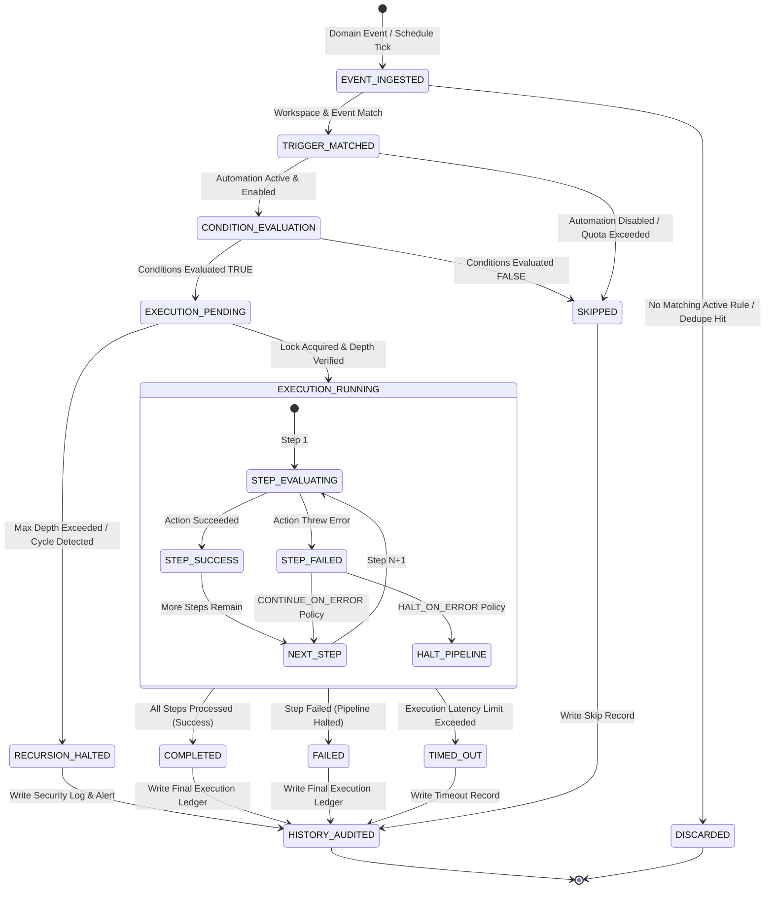

# Phase 1.16.1 — Automation & Workflow Domain Architecture & Specification

> **Document Status**: LOCKED FOR IMPLEMENTATION (Phase 1.16 Architecture Standard)  
> **Domain**: Automations, Workflows, Event Triggers, Condition Evaluation Engine, Action Dispatch Pipeline, Execution State Machine, Automation Scheduling, Loop Prevention & Execution Audit  
> **Dependencies**: Phase 1.1 (Multi-Tenancy & Workspace Partitioning), Phase 1.2 (Authentication & RBAC), Phase 1.3 (Technicians & Organization), Phase 1.4 (Customers & Service Locations), Phase 1.5 (Service Catalog & Work Types), Phase 1.6 (Work Orders), Phase 1.7 (Assets & Equipment), Phase 1.8 (Scheduling & Dispatch), Phase 1.9 (Technician Operations), Phase 1.10 (Inventory & Parts), Phase 1.11 (Quotes & Estimates), Phase 1.12 (Invoicing & Payments), Phase 1.13 (Notifications & Transactional Outbox), Phase 1.14 (Reporting & Analytics), Phase 1.15 (SaaS Billing & Entitlements)  
> **Target Schema & Service Implementation**: Phase 1.16.2 – Phase 1.16.10  
> **Out of Scope (Explicit Non-Goals)**: Phase 1.17 (Third-Party Integrations — Slack, QuickBooks, External Webhooks), Phase 1.18 (Public API & Developer Platform), Phase 1.23 (Visual Automation Builder UI / Drag-and-Drop Canvas)

---

## Executive Summary

Phases 1.1 through 1.15 established Aforden's multi-tenant core, operational field service domains (Work Orders, Scheduling & Dispatch, Mobile Technician Execution, Inventory & Parts, Quotes & Estimates, Invoicing & Field Payments), decoupled multi-channel notification engine, isolated analytical reporting models, and SaaS billing/subscription monetization.

Phase 1.16 introduces the **Automation & Workflow Engine**: the declarative, event-driven, and time-scheduled business logic orchestrator that enables tenants to automate routine operational tasks across Aforden's core domain services.

This document serves as the binding architectural contract for Phase 1.16. Nine foundational domain invariants and one process invariant govern this domain:

1. **Service-Mediated Action Invariant**: Automations never perform raw, direct writes or mutations against the database (`prisma.*`). All automation actions must execute exclusively through allowlisted, validated domain services (e.g., `transitionWorkOrderStatus`, `createInvoiceFromWorkOrder`, `emitNotificationEvent`). This ensures all domain invariants, side-effects, audit histories, and business rules remain strictly enforced.
2. **Strict Multi-Tenant Workspace Isolation**: All automation definitions, triggers, condition groups, actions, scheduled jobs, and execution audit records are strictly scoped to a single `Workspace(id)`. Cross-workspace visibility, trigger listening, action dispatch, or context evaluation is architecturally impossible.
3. **Deterministic Sequential Action Pipeline**: Actions within an automation rule execute strictly sequentially in a deterministic, 1-indexed step order ($1 \to 2 \to \dots \to N$). Step $N+1$ receives the accumulated execution context produced by steps $1 \dots N$. Unconstrained parallelism is forbidden to ensure deterministic causality and error isolation.
4. **Immutable Append-Only Execution Audit Trail**: Once an `AutomationExecution` and its corresponding `AutomationExecutionStep` records are created, their historical audit data is permanently immutable. Records only undergo defined, forward-only lifecycle state machine transitions (`PENDING \to RUNNING \to COMPLETED | FAILED | SKIPPED | TIMED_OUT | CANCELED`). Historical runs can never be rewritten or purged by tenant operations.
5. **Causality Tracking & Multi-Tier Loop Prevention**: To prevent infinite cascading automation loops (e.g., Rule A triggers Rule B, which triggers Rule A), all executions propagate a distributed `correlationId`, a parent `parentExecutionId`, a `causalityChain`, and an `executionDepth` counter. Executions exceeding the maximum depth ceiling ($D_{\max} = 3$) or presenting cyclical signature fingerprints are halted immediately with an explicit recursion error.
6. **Multi-Tier Idempotency & Deduplication Engine**: Duplicate trigger events (from rapid webhook deliveries, retries, or concurrent domain emissions) are intercepted and deduplicated at ingestion time via SHA-256 fingerprint hashes before execution starts, and action handlers enforce domain-level deduplication keys during execution.
7. **Allowlisted Action & Trigger Registries**: Triggers and actions operate via strongly typed, allowlisted registry catalogs. Arbitrary code execution, dynamic eval, reflection, and unvalidated payloads are strictly prohibited.
8. **Explicit Disambiguation from Operational Scheduling**: Automation execution scheduling (cron, interval, and time-offset triggers governed in Phase 1.16) is strictly separated from Phase 1.8 technician/dispatch operational appointment scheduling (`ScheduleAppointment`). These two systems share zero models, zero tables, and zero runtime services.
9. **Structured Error Handling & Failure Policies**: Failures during condition evaluation or action execution are never silently swallowed. Every failure records structured error diagnostics, HTTP/domain error codes, and step execution metrics, with configurable rule-level error behaviors (`HALT_ON_ERROR` vs. `CONTINUE_ON_ERROR`).
10. **Process Decision — Locked 10-Stage Implementation Roadmap**: The subphase sequence is frozen (1.16.1 through 1.16.10), establishing clear architectural boundaries before data modeling and code implementation begin.

---

```
+-----------------------------------------------------------------------------------------------------------------------+
|                                                  WORKSPACE (Tenant)                                                   |
|                                                                                                                       |
|  TRIGGER SOURCES                                              AUTOMATION & WORKFLOW ENGINE (Phase 1.16)               |
|  +---------------------------------------+                    +----------------------------------------------------+  |
|  | Domain Event Ingestion (Phase 1.13)   |                    | 1. Trigger Matching & Ingestion Engine (1.16.3)    |  |
|  | - work_order.status_changed           |--- Domain Event -->| - Workspace Partition Filter                       |  |
|  | - invoice.payment_succeeded           |                    | - Deduplication Hash & Ingestion Filter            |  |
|  +---------------------------------------+                    +-------------------------+--------------------------+  |
|                                                                                         |                             |
|  +---------------------------------------+                                              | matched rule(s)             |
|  | Automation Scheduler (Phase 1.16.7)   |                                              v                             |
|  | - Cron Schedule / Due Date Offset     |--- Timer Tick ---->+----------------------------------------------------+  |
|  +---------------------------------------+                    | 2. Condition Evaluation Engine (1.16.4)            |  |
|                                                               | - Predicate Tree (AND / OR Groups)                 |  |
|                                                               | - Field Path Resolvers & Type Coercion             |  |
|                                                               +-------------------------+--------------------------+  |
|                                                                                         |                             |
|                                                                                         | conditions met              |
|                                                                                         v                             |
|  ===================================================================================================================  |
|  |                                  EXECUTION ENGINE & ACTION DISPATCHER (1.16.5 / 1.16.6)                         |  |
|  |                                                                                                                 |  |
|  |  +-----------------------------------------------------------------------------------------------------------+  |  |
|  |  | Sequential Action Pipeline: Step 1 (Order: 1)  -->  Step 2 (Order: 2)  -->  Step N (Order: N)             |  |  |
|  |  | Context Accumulator: { triggerPayload, step1Result, step2Result, ... }                                   |  |  |
|  |  | Recursion Guard: assert(depth <= MAX_DEPTH && !hasCycle(causalityChain))                                   |  |  |
|  |  +-------------------------------------+-------------------------------------+-------------------------------+  |  |
|  |                                        |                                     |                                 |  |
|  |                                        | Dispatch via Allowlisted Actions    |                                 |  |
|  |                                        v                                     v                                 |  |
|  |                        +-------------------------------+   +-------------------------------+                   |  |
|  |                        | WorkOrderActionDispatcher     |   | InvoiceActionDispatcher       |                   |  |
|  |                        +---------------+---------------+   +---------------+---------------+                   |  |
|  =========================================|===================================|=====================================  |
|                                           | Calls Domain Service              | Calls Domain Service                  |
|                                           v                                   v                                       |
|  +-----------------------------------------------------------------------------------------------------------------+  |
|  | CORE DOMAIN SERVICES LAYER (Phases 1.6 - 1.15)                                                                  |  |
|  | - transitionWorkOrderStatus(workspaceId, workOrderId, input, tx)                                               |  |
|  | - createInvoiceFromWorkOrder(workspaceId, workOrderId, input, actor)                                            |  |
|  | - emitNotificationEvent(tx, input)                                                                              |  |
|  +-----------------------------------------------------------------------------------------------------------------+  |
|                                           |                                                                           |
|                                           | Persists Domain Entities                                                  |
|                                           v                                                                           |
|  +-----------------------------------------------------------------------------------------------------------------+  |
|  | IMMUTABLE AUDIT & EXECUTION LEDGER (Phase 1.16.2 / 1.16.6)                                                      |  |
|  | - AutomationExecution (id, workspaceId, ruleId, status, durationMs, error, causalityChain, correlationId)     |  |
|  | - AutomationExecutionStep (id, executionId, stepOrder, actionType, status, inputJson, outputJson, errorJson)    |  |
|  +-----------------------------------------------------------------------------------------------------------------+  |
+-----------------------------------------------------------------------------------------------------------------------+
```

---

## 1. Canonical Terminology

To guarantee semantic consistency across all subphases (1.16.2 through 1.16.10), the following twelve terms are locked with exact, unambiguous definitions. No subsequent implementation stage may alter or broaden these definitions.

| Term | Canonical Architectural Definition | What It Is NOT |
| :--- | :--- | :--- |
| **Automation** | A tenant-configured declarative rule (`AutomationRule`) within a single workspace comprising exactly one **Trigger**, an optional composite **Condition Group**, and an ordered sequence of one or more **Actions**, along with enablement status, metadata, and execution controls. | It is **not** a general-purpose programming script, an unconstrained code hook, or a visual diagram node. |
| **Workflow** | An interchangeable synonym for a multi-step **Automation** that orchestrates state transitions across one or more Aforden domain services in a defined sequence. | It is **not** an external BPMN diagram, an interactive human approval task list, or a long-running saga requiring manual user interaction. |
| **Trigger** | The declarative specification of an activating event or temporal condition (`AutomationTrigger`) that initiates the automation evaluation pipeline. Triggers are classified as either **Event-Driven** (e.g., `work_order.completed`, `invoice.created`) or **Scheduled** (e.g., cron interval, temporal offset from due date). | It is **not** an arbitrary webhook endpoint, an unvalidated database trigger, or a client-side DOM event. |
| **Condition** | A deterministic boolean predicate (`AutomationCondition`) that evaluates a field path from the trigger payload or accumulated execution context against a target value using an explicit comparison operator (`EQUALS`, `NOT_EQUALS`, `GREATER_THAN`, `IN`, `CONTAINS`, etc.). Conditions are combined in nested `AND`/`OR` **Condition Groups**. | It is **not** an arbitrary JavaScript/SQL expression or an asynchronous side-effecting query. |
| **Action** | An individual, discrete operational task (`AutomationAction`) within an automation rule that invokes a single allowlisted Aforden domain service with strictly validated input parameters derived from static values or templated context variables. | It is **not** a direct Prisma database query, a raw SQL statement, or an unvetted third-party HTTP call. |
| **Execution** | A single runtime instance (`AutomationExecution`) of an automation rule triggered by a specific event or schedule tick. It tracks overall execution status (`PENDING`, `RUNNING`, `COMPLETED`, `FAILED`, `SKIPPED`, `TIMED_OUT`, `CANCELED`), start/end timestamps, triggering payload, correlation identifiers, and summary metrics. | It is **not** a mutable configuration record or a transient in-memory log. |
| **Execution Step** | An immutable audit record (`AutomationExecutionStep`) representing the granular execution of a single Action within an Execution. It records step sequence order, action type, evaluated inputs, returned outputs, status, latency in milliseconds, and error details if failed. | It is **not** an isolated background worker job or an asynchronous independent rule. |
| **Schedule** | A temporal trigger definition (`AutomationScheduleJob`) specifying when an automation must run based on a cron expression, a recurring fixed interval, or a dynamic time offset relative to an entity date field (e.g., "24 hours before `WorkOrder.scheduledStartDate`"). | It is **not** a technician appointment or dispatch booking (`ScheduleAppointment` from Phase 1.8). |
| **Retry** | The controlled re-execution of a transiently failed execution or action step according to a deterministic backoff strategy, requiring guaranteed idempotency and bounded attempt limits. | It is **not** an infinite loop, an unmonitored retry loop, or a retry of non-transient validation errors. |
| **Failure** | An unrecoverable error or exception encountered during condition evaluation or action execution that prevents normal completion of a step or execution. | It is **not** a graceful condition non-match (which results in `SKIPPED` status). |
| **Idempotency** | The architectural guarantee that processing the identical triggering event or executing the identical action step multiple times produces the exact same side effects and domain state as executing it exactly once. | It is **not** merely ignoring errors or discarding duplicate database writes without verification. |
| **Correlation ID** | A globally unique UUID (`correlationId`) assigned at the inception of a root event or execution that is passed down through all downstream events, service invocations, child executions, and audit logs to trace end-to-end causality and enforce loop detection. | It is **not** a database primary key of a single business entity. |

---

## 2. Canonical Execution Lifecycle & State Machine

The automation execution lifecycle follows an immutable, forward-only pipeline:

$$\text{EVENT / SCHEDULE} \longrightarrow \text{TRIGGER MATCH} \longrightarrow \text{CONDITION EVALUATION} \longrightarrow \text{ACTION EXECUTION} \longrightarrow \text{EXECUTION RESULT} \longrightarrow \text{HISTORY / AUDIT}$$

### 2.1 State Diagram & Transition Rules



### 2.2 Detailed Execution Stage Breakdown

#### Stage 1: Trigger Ingestion & Event Capture
- **Source**: A domain event is emitted via the transactional outbox / domain event pipeline (`emitNotificationEvent` in `lib/services/notification/eventIngestionService.ts`) or a timer tick is generated by the Automation Scheduler.
- **Ingestion Deduplication**: Computes the Tier 1 Ingestion Deduplication Hash:
  $$\text{dedupeKey} = \text{SHA256}(\text{workspaceId} + ":" + \text{eventType} + ":" + \text{sourceEntity} + ":" + \text{sourceId} + ":" + \text{eventTimestamp})$$
- **Persistence**: If duplicate within deduplication window (default 5 minutes), the event is dropped. Otherwise, matching active rules in the workspace are queried.

#### Stage 2: Trigger Matching & Filtering
- Queries all active `AutomationRule` records in the given `workspaceId` where `trigger.eventType == event.eventType` (or schedule job matches current tick).
- Checks tenant status: If workspace subscription is inactive, past due, suspended, or has automation entitlement disabled (`FEATURE_AUTOMATIONS == false`), execution is halted with status `SKIPPED` (Reason: `ENTITLEMENT_INACTIVE`).

#### Stage 3: Condition Evaluation
- For each matched rule, the Condition Engine evaluates the root `AutomationConditionGroup`.
- Recursively evaluates nested child condition groups with `AND` / `OR` logical operators.
- Resolves field paths (e.g., `trigger.payload.workOrder.priority`, `trigger.payload.invoice.totalAmountCents`) against the event context.
- Applies strict type coercion and comparator validation (`EQUALS`, `GREATER_THAN_OR_EQUAL`, etc.).
- **Outcome**: If conditions evaluate to `false`, an `AutomationExecution` record is created with status `SKIPPED` (Reason: `CONDITIONS_NOT_MET`) and execution concludes without executing any actions.

#### Stage 4: Execution Initialization & Pre-Flight Guards
- **Recursion & Cycle Check**:
  1. Reads incoming `executionDepth` from event context (default 0 for human-initiated events).
  2. If $\text{executionDepth} > D_{\max}$ (where $D_{\max} = 3$), execution is aborted with status `FAILED` (Reason: `MAX_EXECUTION_DEPTH_EXCEEDED`).
  3. Inspects `causalityChain` for repeated `ruleId` occurrences; if a cycle is detected, execution is aborted with status `FAILED` (Reason: `RECURSIVE_CYCLE_DETECTED`).
- **Execution Record Creation**: Atomically inserts `AutomationExecution` in state `PENDING`, transitioning to `RUNNING` upon worker acquisition.

#### Stage 5: Sequential Action Execution Pipeline
- Retrieves all `AutomationAction` records for the rule, ordered strictly by `stepOrder ASC`.
- Initializes the `ExecutionContext`:
  ```typescript
  interface ExecutionContext {
    workspaceId: string;
    correlationId: string;
    parentExecutionId?: string | null;
    executionDepth: number;
    causalityChain: string[];
    actorMemberId?: string | null;
    trigger: {
      eventType: string;
      sourceEntity: string;
      sourceId: string;
      payload: Record<string, unknown>;
    };
    stepOutputs: Record<number, Record<string, unknown>>; // Keyed by stepOrder
  }
  ```
- Iterates through actions sequentially ($i = 1 \dots N$):
  1. Inserts `AutomationExecutionStep` with status `RUNNING`.
  2. Resolves template tokens in action parameters using `ExecutionContext` (e.g., `{{trigger.payload.customerId}}`, `{{steps.1.workOrderId}}`).
  3. Dispatches action to the dedicated allowlisted domain action handler.
  4. The domain action handler invokes the corresponding Aforden Domain Service within the appropriate transaction context.
  5. Upon success: Updates `AutomationExecutionStep` to `COMPLETED`, records `outputJson` and `durationMs`, and stores result in `stepOutputs[i]`.
  6. Upon error: Updates `AutomationExecutionStep` to `FAILED`, records `errorJson` and `durationMs`. Evaluates rule error policy (`HALT_ON_ERROR` halts subsequent steps; `CONTINUE_ON_ERROR` proceeds to step $i+1$).

#### Stage 6: Execution Finalization & Terminal State Recording
- Updates `AutomationExecution` to its final terminal status:
  - `COMPLETED`: All actions succeeded (or non-critical errors skipped under `CONTINUE_ON_ERROR`).
  - `FAILED`: A step failed under `HALT_ON_ERROR` or unhandled execution exception occurred.
  - `TIMED_OUT`: Total execution duration exceeded the workspace step timeout ceiling (default 30 seconds).
- Records `completedAt`, total `durationMs`, and aggregates summary statistics.

#### Stage 7: History & Audit Persistence
- Emits execution completion telemetry.
- Execution history and step logs become permanently read-only and immutable.

### 2.3 Short-Circuit Matrix

| Short-Circuit Trigger | Stage Occurred | Resulting Execution Status | Is Step Record Created? | Reason Code |
| :--- | :--- | :--- | :--- | :--- |
| Duplicate Event Ingestion | Stage 1 (Ingestion) | *None* (Dropped at Ingestion) | No | `DUPLICATE_INGESTION_EVENT` |
| Workspace Rule Disabled | Stage 2 (Matching) | `SKIPPED` | No | `RULE_DISABLED` |
| Workspace Suspended / Entitlement Inactive | Stage 2 (Matching) | `SKIPPED` | No | `ENTITLEMENT_INACTIVE` |
| Conditions Evaluated to FALSE | Stage 3 (Conditions) | `SKIPPED` | No | `CONDITIONS_NOT_MET` |
| Execution Depth Limit Exceeded ($D > 3$) | Stage 4 (Pre-Flight) | `FAILED` | No | `MAX_EXECUTION_DEPTH_EXCEEDED` |
| Recursive Cycle Signature Detected | Stage 4 (Pre-Flight) | `FAILED` | No | `RECURSIVE_CYCLE_DETECTED` |
| Action Validation Failure | Stage 5 (Execution) | `FAILED` | Yes (Current Step `FAILED`) | `ACTION_PARAM_VALIDATION_ERROR` |
| Domain Service Exception (`HALT_ON_ERROR`) | Stage 5 (Execution) | `FAILED` | Yes (Current Step `FAILED`) | `DOMAIN_SERVICE_ERROR` |
| Execution Latency Ceiling Exceeded | Stage 5 (Execution) | `TIMED_OUT` | Yes (Current Step `TIMED_OUT`) | `EXECUTION_TIMEOUT` |

---

## 3. Locked Invariants (9 Domain Invariants)

These nine domain invariants are binding rules enforced across all schemas, services, and APIs in Phase 1.16.

### Invariant 1: Multi-Tenant Partitioning & Workspace Isolation
- **Rule**: Every automation model (`AutomationRule`, `AutomationTrigger`, `AutomationConditionGroup`, `AutomationCondition`, `AutomationAction`, `AutomationExecution`, `AutomationExecutionStep`, `AutomationScheduleJob`) must include an explicit, foreign-key-backed `workspaceId` column referencing `Workspace(id)`.
- **Enforcement**:
  1. Every query, mutation, and lookup in the automation domain must include `where: { workspaceId }`.
  2. Event ingestion strictly matches rules where `rule.workspaceId == event.workspaceId`. Cross-workspace event routing is impossible.
  3. Action parameter resolvers cannot access or reference entities belonging to another workspace. If a resolved ID belongs to another tenant, the domain service rejects the call with a tenant isolation error (`CrossTenantViolationError`).

### Invariant 2: Authentication & Role-Based Access Control (RBAC)
- **Rule**: All automation administration, manual execution, and audit log inspection must be protected by explicit RBAC permissions.
- **Reference**: Permissions are defined in `lib/services/authorization/permissions.ts` and mapped in `lib/services/authorization/rolePermissions.ts`.
- **Permission Matrix**:

| Permission Identifier | Description | OWNER | ADMIN | MANAGER | DISPATCHER | TECHNICIAN | ACCOUNTANT |
| :--- | :--- | :---: | :---: | :---: | :---: | :---: | :---: |
| `automations.view` | View automation rules, triggers, actions, and schedules | ✅ | ✅ | ✅ | ❌ | ❌ | ❌ |
| `automations.create` | Create new automation rules and action configurations | ✅ | ✅ | ❌ | ❌ | ❌ | ❌ |
| `automations.update` | Update existing rules, modify conditions/actions, enable/disable | ✅ | ✅ | ❌ | ❌ | ❌ | ❌ |
| `automations.delete` | Delete or archive automation rules | ✅ | ✅ | ❌ | ❌ | ❌ | ❌ |
| `automations.trigger` | Manually test or force-trigger an automation execution | ✅ | ✅ | ✅ | ❌ | ❌ | ❌ |
| `automations.history_view` | View execution history, step audit logs, and error diagnostics | ✅ | ✅ | ✅ | ❌ | ❌ | ❌ |

- **Permission Definitions to Add in Phase 1.16.8 / 1.16.2**:
  ```typescript
  // lib/services/authorization/permissions.ts [PROPOSED — TO BE INTRODUCED IN PHASE 1.16]
  export const PERMISSIONS = {
    // ... existing permissions ...
    AUTOMATIONS_VIEW: "automations.view",
    AUTOMATIONS_CREATE: "automations.create",
    AUTOMATIONS_UPDATE: "automations.update",
    AUTOMATIONS_DELETE: "automations.delete",
    AUTOMATIONS_TRIGGER: "automations.trigger",
    AUTOMATIONS_HISTORY_VIEW: "automations.history_view",
  } as const;
  ```

### Invariant 3: Execution Ordering & Deterministic Sequencing
- **Rule**: Actions within a rule execute strictly sequentially according to `stepOrder` ($1 \le \text{stepOrder} \le N$).
- **Context Propagation**: Action Step $K$ ($K > 1$) can reference outputs produced by Action Steps $1 \dots K-1$ via templated variables (`{{steps.1.outputField}}`).
- **Parallelism Policy**: Concurrent or out-of-order execution of actions within a single automation rule is strictly forbidden in Phase 1.16. Sequential execution ensures deterministic reproducibility, clear causality, and simple rollback/halt semantics.

### Invariant 4: Immutable Execution History & Append-Only Ledger
- **Rule**: Once created, `AutomationExecution` and `AutomationExecutionStep` records are append-only.
- **Permitted Mutations**: Only forward-only status updates during active execution lifecycle (`PENDING \to RUNNING \to COMPLETED | FAILED | SKIPPED | TIMED_OUT | CANCELED`).
- **No Retroactive Rewriting**: Once an execution reaches a terminal status, its payload, output, error, duration, and step records are permanently frozen. Tenant users cannot edit, redact, or overwrite execution records.

### Invariant 5: Multi-Tier Idempotency & Deduplication
- **Tier 1 (Event Ingestion Deduplication)**: Prevents identical incoming events from spawning duplicate executions within a rolling 5-minute deduplication window.
  $$\text{ingestionKey} = \text{SHA256}(\text{workspaceId} + ":" + \text{eventType} + ":" + \text{sourceEntity} + ":" + \text{sourceId} + ":" + \text{eventHash})$$
- **Tier 2 (Execution Deduplication)**: An automation execution acquires a transactional advisory lock or unique constraint on `(workspaceId, ruleId, dedupeKey)` before state changes are evaluated.
- **Tier 3 (Action Handler Idempotency)**: Allowlisted action dispatchers compute deterministic idempotency keys before invoking domain services, ensuring that retried steps do not create duplicate domain entities (e.g., duplicate invoices or work orders).

### Invariant 6: Failure Handling & Error Isolation
- **Rule**: An action error must never be silently caught or discarded without recording an explicit failure state.
- **Action-Level Failure vs. Execution-Level Failure**:
  - **Action Failure**: Occurs when a specific domain service throws an error or returns a failure response. The corresponding `AutomationExecutionStep` is marked `FAILED` with detailed `errorJson` (code, message, stack trace snapshot).
  - **Execution Failure**: If the rule's `errorPolicy` is `HALT_ON_ERROR` (the default), an action failure immediately halts the pipeline, cancels subsequent steps, and marks the parent `AutomationExecution` as `FAILED`. If `errorPolicy` is `CONTINUE_ON_ERROR`, the failure is recorded on the step, and the engine advances to Step $K+1$.

### Invariant 7: Retry Boundaries & Transient Failure Contract
- **Boundary**: Full retry policies, backoff mechanics, and Dead Letter Queue (DLQ) processing are implemented in Phase 1.16.9. The architectural contract locked here governs retry qualifications:
  1. **Transient Errors Only**: Retries are permitted exclusively for transient infrastructure failures (e.g., database connection timeout, transient deadlock, network glitch in notification delivery).
  2. **Non-Transient Failures are Fatal**: Business validation failures (e.g., `WorkOrderNotFoundError`, `InvalidStatusTransitionError`, `InsufficientPermissionsError`, `QuotaExceededError`) must fail immediately and must **never** be retried.
  3. **Idempotency Requirement**: No action step may be retried unless its underlying domain service dispatcher guarantees idempotent execution.
  4. **Max Attempt Ceiling**: Maximum retry attempts for any single step are capped at 3 with exponential backoff and full jitter.

### Invariant 8: Recursion Prevention & Infinite Loop Breaking
- **Rule**: Cascading automation loops must be detected and broken with zero risk of runaway recursion.
- **Prevention Mechanisms**:
  1. **Correlation Tracking**: Every execution inherits or generates a `correlationId`.
  2. **Execution Depth Ceiling ($D_{\max} = 3$)**: Every triggered automation increments `executionDepth = parentExecutionDepth + 1`. If $\text{executionDepth} > 3$, execution halts immediately.
  3. **Causality Chain Cycle Detection**: Every execution tracks `causalityChain: string[]` containing the ordered list of `ruleId`s executed in the chain. If `currentRuleId` already exists in `causalityChain`, a cycle is detected and execution is aborted.
  4. **Deduplication Cooldown**: A rule cannot be triggered for the same source entity twice within a 10-second window.

#### Concrete Worked Example: The Infinite Loop Scenario & Defense

```
[Scenario]
Rule A: WHEN WorkOrder.status == 'COMPLETED'  --> ACTION: Create Invoice
Rule B: WHEN Invoice.status == 'CREATED'      --> ACTION: Add Note to WorkOrder
Rule C: WHEN WorkOrder.updated                --> ACTION: Transition WorkOrder to 'COMPLETED'
```

Without recursion prevention, this creates an infinite loop:
$$\text{Rule A} \longrightarrow \text{Rule B} \longrightarrow \text{Rule C} \longrightarrow \text{Rule A} \longrightarrow \text{Rule B} \dots$$

**How Aforden's Locked Invariants Break the Loop:**

| Hop | Step | `executionDepth` | `causalityChain` | Action Taken | Result |
| :---: | :--- | :---: | :--- | :--- | :--- |
| **0** | Technician marks WorkOrder `COMPLETED` via UI | 0 | `[]` | Triggers Rule A | **Allowed** |
| **1** | Rule A executes, creates Invoice | 1 | `["rule_A"]` | Triggers Rule B | **Allowed** |
| **2** | Rule B executes, updates WorkOrder note | 2 | `["rule_A", "rule_B"]` | Triggers Rule C | **Allowed** |
| **3** | Rule C executes, transitions WorkOrder to `COMPLETED` | 3 | `["rule_A", "rule_B", "rule_C"]` | Attempts to trigger Rule A | **Evaluated** |
| **4** | Rule A receives event | 4 | `["rule_A", "rule_B", "rule_C"]` | **Invariant 8.2 (Max Depth $4 > 3$) & Invariant 8.3 (Cycle: `"rule_A"` already in chain) TRIGGER** | 🛑 **BLOCKED IMMEDIATELY** |

- **Execution Outcome**: Execution 4 is aborted with status `FAILED` and error code `RECURSIVE_CASCADE_HALTED`. An alert is logged, and the cycle is terminated with zero runaway resource consumption.

### Invariant 9: Action Allowlisting & Service-Mediated Execution
- **Rule**: Automations may only invoke registered, allowlisted action handlers backed by real Aforden domain services.
- **Prohibitions**:
  - ❌ **Direct Database Writes Forbidden**: Automation engine code is forbidden from calling `prisma.workOrder.update()`, `prisma.invoice.create()`, or any direct table mutation.
  - ❌ **Dynamic / Reflective Invocations Forbidden**: Dynamic evaluation (e.g., `eval()`, `new Function()`, reflective method invocation based on user input strings) is forbidden.
  - ❌ **Unvetted Actions Forbidden**: Every action must map to an explicit enum `AutomationActionType` backed by a statically typed, Zod-validated action handler.

---

## 4. Domain Boundary Architecture & Service Mediation

### 4.1 The Golden Boundary Rule

$$\text{Automation Engine} \longrightarrow \text{Action Handler} \longrightarrow \text{Domain Service} \longrightarrow \text{Domain Model (Prisma)}$$

```
+-----------------------------------------------------------------------------------------------------------------+
|                                           AUTOMATION ENGINE DOMAIN                                              |
|                                                                                                                 |
|   +---------------------------------------------------------------------------------------------------------+   |
|   | AutomationExecutionEngine.executeStep(step, context)                                                    |   |
|   | - Validates step inputs against Action Schema                                                           |   |
|   | - Resolves templated parameters                                                                         |   |
|   | - Looks up Action Handler in ActionRegistry                                                             |   |
|   +---------------------------------------------------+-----------------------------------------------------+   |
|                                                       |                                                         |
|                                                       v                                                         |
|   +---------------------------------------------------------------------------------------------------------+   |
|   | Allowlisted Action Handler (e.g., TransitionWorkOrderStatusActionHandler)                               |   |
|   | - Adapts generic automation payload to typed domain input                                               |   |
|   | - Enforces action-level validation and idempotency                                                      |   |
|   +---------------------------------------------------+-----------------------------------------------------+   |
+-------------------------------------------------------|---------------------------------------------------------+
                                                        | Calls Domain Service (Never Prisma)
                                                        v
+-----------------------------------------------------------------------------------------------------------------+
|                                           CORE DOMAIN SERVICES LAYER                                            |
|                                                                                                                 |
|   +---------------------------------------------------------------------------------------------------------+   |
|   | transitionWorkOrderStatus(workspaceId, workOrderId, input, txClient)                                    |   |
|   | - Validates business state transitions (e.g., OPEN -> IN_PROGRESS -> COMPLETED)                         |   |
|   | - Enforces RBAC / actor permissions and technician assignment invariants                                |   |
|   | - Records WorkOrderHistory audit log entries                                                            |   |
|   | - Emits downstream domain events to NotificationOutbox (Phase 1.13)                                      |   |
|   +---------------------------------------------------+-----------------------------------------------------+   |
|                                                       |                                                         |
|                                                       v                                                         |
|   +---------------------------------------------------------------------------------------------------------+   |
|   | Prisma Client (tx.workOrder.update, tx.workOrderHistory.create)                                         |   |
|   +---------------------------------------------------------------------------------------------------------+   |
+-----------------------------------------------------------------------------------------------------------------+
```

### 4.2 Concrete Real-World Domain Walkthroughs

The following walkthroughs reflect the verified function signatures and module structures across Aforden's operational services:

#### Walkthrough 1: Work Order Status Transition & Technician Assignment
- **Goal**: Automatically assign a high-priority work order to an on-call technician and transition its status to `ASSIGNED` or `IN_PROGRESS`.
- **Target Domain Service Paths**:
  - `assignWorkOrder` in [`lib/services/workOrder/assignWorkOrder.ts`](file:///d:/Download/aforden/lib/services/workOrder/assignWorkOrder.ts) (re-exported via [`lib/services/workOrder/index.ts`](file:///d:/Download/aforden/lib/services/workOrder/index.ts))
  - `transitionWorkOrderStatus` in [`lib/services/workOrder/transitionWorkOrderStatus.ts`](file:///d:/Download/aforden/lib/services/workOrder/transitionWorkOrderStatus.ts) (re-exported via [`lib/services/workOrder/index.ts`](file:///d:/Download/aforden/lib/services/workOrder/index.ts))
- **Antipattern (FORBIDDEN)**:
  ```typescript
  // ❌ ILLEGAL: Direct Prisma write bypassing domain validation and history
  await prisma.workOrder.update({
    where: { id: workOrderId },
    data: { status: "ASSIGNED", assignedTechnicianId: techId },
  });
  ```
- **Aforden Standard (MANDATORY)**:
  ```typescript
  // ✅ CORRECT: Dispatched through allowlisted Action Handler to Domain Services
  import { assignWorkOrder, transitionWorkOrderStatus } from "@/lib/services/workOrder";

  export class AssignAndTransitionWorkOrderActionHandler implements ActionHandler {
    async execute(ctx: ActionExecutionContext, params: { workOrderId: string; technicianId: string }): Promise<ActionResult> {
      // 1. Invoke Work Order Assignment Domain Service
      const assignedWO = await assignWorkOrder(
        ctx.workspaceId,
        params.workOrderId,
        { technicianId: params.technicianId },
        ctx.actorContext,
        ctx.prismaTx
      );

      // 2. Invoke Work Order Status Transition Service
      const transitionedWO = await transitionWorkOrderStatus(
        ctx.workspaceId,
        params.workOrderId,
        {
          toStatus: "ASSIGNED",
          reason: "Automated assignment via Rule: " + ctx.ruleName,
        },
        ctx.prismaTx
      );

      return {
        success: true,
        data: { workOrderId: transitionedWO.id, status: transitionedWO.status, assignedTechnicianId: transitionedWO.assignedTechnicianId },
      };
    }
  }
  ```

#### Walkthrough 2: Automated Invoice Creation upon Work Order Completion
- **Goal**: When a Work Order transitions to `COMPLETED`, automatically generate a draft Invoice populated with labor and consumed parts.
- **Target Domain Service Path**:
  - `createInvoiceFromWorkOrder` in [`lib/services/invoice/createInvoiceFromWorkOrder.ts`](file:///d:/Download/aforden/lib/services/invoice/createInvoiceFromWorkOrder.ts) (re-exported via [`lib/services/invoice/index.ts`](file:///d:/Download/aforden/lib/services/invoice/index.ts))
- **Aforden Standard (MANDATORY)**:
  ```typescript
  // ✅ CORRECT: Calls Invoice Domain Service with WorkOrder reference
  import { createInvoiceFromWorkOrder } from "@/lib/services/invoice";

  export class CreateInvoiceFromWorkOrderActionHandler implements ActionHandler {
    async execute(ctx: ActionExecutionContext, params: { workOrderId: string; paymentTermsDays?: number }): Promise<ActionResult> {
      const invoice = await createInvoiceFromWorkOrder(
        ctx.workspaceId,
        params.workOrderId,
        {
          paymentTermsDays: params.paymentTermsDays ?? 30,
          notes: "Automated invoice generated upon work order completion.",
        },
        ctx.actorContext
      );

      return {
        success: true,
        data: { invoiceId: invoice.id, invoiceNumber: invoice.invoiceNumber, totalAmountCents: invoice.totalAmount },
      };
    }
  }
  ```

#### Walkthrough 3: Automated Multi-Channel Notification Dispatch
- **Goal**: Notify the customer and dispatch manager when an urgent work order is delayed or modified.
- **Target Domain Service Path**:
  - `emitNotificationEvent` in [`lib/services/notification/eventIngestionService.ts`](file:///d:/Download/aforden/lib/services/notification/eventIngestionService.ts) (re-exported via [`lib/services/notification/index.ts`](file:///d:/Download/aforden/lib/services/notification/index.ts))
- **Aforden Standard (MANDATORY)**:
  ```typescript
  // ✅ CORRECT: Emits event into Phase 1.13 Transactional Outbox
  import { emitNotificationEvent, NotificationEventType } from "@/lib/services/notification";

  export class SendAutomatedNotificationActionHandler implements ActionHandler {
    async execute(ctx: ActionExecutionContext, params: { workOrderId: string; workOrderNumber: string; delayReason: string }): Promise<ActionResult> {
      const outboxEntry = await emitNotificationEvent(ctx.prismaTx, {
        workspaceId: ctx.workspaceId,
        eventType: NotificationEventType.WORK_ORDER_DELAYED,
        sourceEntity: "WorkOrder",
        sourceId: params.workOrderId,
        actorMemberId: ctx.actorMemberId ?? null,
        payload: {
          workOrderId: params.workOrderId,
          workOrderNumber: params.workOrderNumber,
          delayReason: params.delayReason,
        },
      });

      return { success: true, data: { outboxId: outboxEntry.id } };
    }
  }
  ```

---

## 5. Explicit Non-Goals & Domain Disambiguation

### 5.1 Explicit Non-Goals for Phase 1.16

To maintain strict scope control and prevent architectural creep across subphases, the following capabilities are explicitly classified as non-goals for Phase 1.16:

1. **No Third-Party Integrations or External Webhooks (Deferred to Phase 1.17)**:
   - No integration with Slack, Microsoft Teams, QuickBooks, Xero, Google Calendar, or Zapier.
   - No outbound HTTP webhook actions or inbound external webhook triggers.
   - Phase 1.16 operates strictly within Aforden's internal domain services.
2. **No Public API Keys or Developer Platform (Deferred to Phase 1.18)**:
   - No public developer REST endpoints, OAuth applications, or API key management for automation manipulation.
3. **No Visual Workflow Builder UI or Drag-and-Drop Canvas (Deferred to Phase 1.23)**:
   - Phase 1.16 builds the headless core: schemas, domain services, execution engine, condition compiler, and internal REST management endpoints. Visual graph builders and canvas UIs belong strictly to Phase 1.23.
4. **No Arbitrary User Code / Scripting Execution**:
   - No execution of tenant-submitted JavaScript, Python, or SQL. All logic is strictly declarative and schema-driven.

### 5.2 Crucial Disambiguation: Automation Scheduling vs. Operational Dispatch Scheduling

Aforden contains two distinct scheduling concepts that must never be conflated:

| Architectural Dimension | Phase 1.8: Operational Scheduling & Dispatch | Phase 1.16: Automation Execution Scheduling |
| :--- | :--- | :--- |
| **What is being scheduled?** | **Technician field labor**: appointments, dispatch slots, travel buffers, and technician calendar availability. | **System automation runs**: time-based triggers, cron recurring tasks, and relative due-date offset timers. |
| **Primary Entities** | `ScheduleAppointment`, `TechnicianAvailability`, `TechnicianServiceArea`, `AppointmentHistory`. | `AutomationScheduleJob`, `AutomationExecution`, `AutomationTrigger`. |
| **Primary Domain Service** | `createSchedule`, `dispatchAppointment`, `conflictDetection` in `lib/services/schedule/`. | `automationScheduleEngine` (`registerScheduleJob`, `processScheduledTick`). |
| **Key Actors** | Dispatchers, Technicians, Service Managers, End-Customers. | Automated Background Worker, System Cron Evaluator. |
| **Temporal Logic** | Technician working hours, time zone conflicts, travel time estimations, skills matching. | Cron syntax parsing (`0 9 * * 1`), relative offset calculations ("2 hours after `Invoice.dueDate`"). |
| **Database Models Shared** | None. Zero table sharing. | None. Zero table sharing. |

---

## 6. Preliminary Catalog Sketch (Subject to Refinement in 1.16.2–1.16.5)

> **Notice**: The following catalog is a preliminary architectural projection. Specific enum values, operators, and payload schemas are non-binding and subject to refinement during subphases 1.16.2 through 1.16.5.

### 6.1 Preliminary Trigger Types (`AutomationTriggerType`)

```
+-------------------------------------------------------------------------------------------------------+
|                                      PRELIMINARY TRIGGER CATALOG                                      |
+------------------------------------+------------------------------------+-----------------------------+
| Trigger Identifier                 | Category                           | Source Domain               |
+------------------------------------+------------------------------------+-----------------------------+
| WORK_ORDER_CREATED                 | Event-Driven                       | Work Order (Phase 1.6)      |
| WORK_ORDER_STATUS_CHANGED          | Event-Driven                       | Work Order (Phase 1.6/1.9)  |
| WORK_ORDER_ASSIGNED                | Event-Driven                       | Work Order (Phase 1.6)      |
| WORK_ORDER_COMPLETED               | Event-Driven                       | Work Order (Phase 1.6/1.9)  |
| QUOTE_APPROVED                     | Event-Driven                       | Quotes (Phase 1.11)         |
| QUOTE_EXPIRED                      | Event-Driven                       | Quotes (Phase 1.11)         |
| INVOICE_ISSUED                     | Event-Driven                       | Invoicing (Phase 1.12)      |
| INVOICE_PAYMENT_RECORDED           | Event-Driven                       | Invoicing (Phase 1.12)      |
| INVOICE_OVERDUE                    | Event / Temporal                   | Invoicing (Phase 1.12)      |
| INVENTORY_LOW_STOCK_REACHED        | Event-Driven                       | Inventory (Phase 1.10)      |
| ASSET_MAINTENANCE_DUE              | Temporal / Event                   | Assets (Phase 1.7)          |
| SCHEDULED_CRON                     | Time-Driven (Cron Expression)      | Automation Scheduler (1.16) |
| SCHEDULED_INTERVAL                 | Time-Driven (Fixed Interval)       | Automation Scheduler (1.16) |
| SCHEDULED_ENTITY_OFFSET            | Time-Driven (Offset from Field)    | Automation Scheduler (1.16) |
+------------------------------------+------------------------------------+-----------------------------+
```

### 6.2 Preliminary Condition Operators (`ConditionOperator`)

```typescript
export enum ConditionOperator {
  // Equality & Comparison
  EQUALS = "EQUALS",
  NOT_EQUALS = "NOT_EQUALS",
  GREATER_THAN = "GREATER_THAN",
  GREATER_THAN_OR_EQUAL = "GREATER_THAN_OR_EQUAL",
  LESS_THAN = "LESS_THAN",
  LESS_THAN_OR_EQUAL = "LESS_THAN_OR_EQUAL",

  // String Matching
  CONTAINS = "CONTAINS",
  NOT_CONTAINS = "NOT_CONTAINS",
  STARTS_WITH = "STARTS_WITH",
  ENDS_WITH = "ENDS_WITH",
  MATCHES_REGEX = "MATCHES_REGEX",

  // Collection & Array
  IN = "IN",
  NOT_IN = "NOT_IN",
  IS_EMPTY = "IS_EMPTY",
  IS_NOT_EMPTY = "IS_NOT_EMPTY",

  // Nullability & Boolean
  IS_NULL = "IS_NULL",
  IS_NOT_NULL = "IS_NOT_NULL",
  IS_TRUE = "IS_TRUE",
  IS_FALSE = "IS_FALSE",

  // Date / Temporal
  BEFORE_DATE = "BEFORE_DATE",
  AFTER_DATE = "AFTER_DATE",
  WITHIN_LAST_DAYS = "WITHIN_LAST_DAYS",
  WITHIN_NEXT_DAYS = "WITHIN_NEXT_DAYS",
}
```

### 6.3 Preliminary Action Types (`AutomationActionType`)

```
+-------------------------------------------------------------------------------------------------------+
|                                       PRELIMINARY ACTION CATALOG                                      |
+------------------------------------+------------------------------------+-----------------------------+
| Action Identifier                  | Target Domain Service              | Operational Purpose         |
+------------------------------------+------------------------------------+-----------------------------+
| WORK_ORDER_CREATE                  | createWorkOrder                    | Spawn a new work order      |
| WORK_ORDER_UPDATE_STATUS           | transitionWorkOrderStatus          | Transition status lifecycle |
| WORK_ORDER_ASSIGN_TECHNICIAN       | assignWorkOrder                    | Assign tech profile         |
| WORK_ORDER_ADD_NOTE                | updateWorkOrder                    | Add operational audit note  |
| INVOICE_CREATE_FROM_WORK_ORDER     | createInvoiceFromWorkOrder         | Auto-generate draft invoice |
| INVOICE_ISSUE                      | issueInvoice                       | Issue and finalize invoice  |
| NOTIFICATION_SEND_EMAIL            | emitNotificationEvent              | Trigger transactional email |
| NOTIFICATION_SEND_IN_APP           | emitNotificationEvent              | Add entry to in-app feed    |
| INVENTORY_RESERVE_PARTS            | reserveParts                       | Reserve required parts      |
| CUSTOMER_UPDATE_STATUS             | updateCustomer                     | Update customer tags/status |
| ASSET_SCHEDULE_MAINTENANCE         | createSchedule                     | Create maintenance order    |
+------------------------------------+------------------------------------+-----------------------------+
```

---

## 7. Phase 1.16 Implementation Roadmap

The implementation of Phase 1.16 is partitioned into ten sequential subphases:

```
+---------------------------------------------------------------------------------------------------+
|                              PHASE 1.16 SUBPHASE EXECUTION ROADMAP                                |
+---------+-----------------------------------------------------+-----------------------------------+
| Stage   | Title                                               | Scope / Deliverable               |
+---------+-----------------------------------------------------+-----------------------------------+
| 1.16.1  | Automation & Workflow Domain Architecture           | Architectural standard & contract |
| 1.16.2  | Automation Data Models & Prisma Schema              | Prisma models, enums & migrations |
| 1.16.3  | Trigger Ingestion & Event Matching Engine           | Event catalog, trigger matcher    |
| 1.16.4  | Condition Evaluation & Predicate Compiler Engine    | AND/OR tree, field path resolver  |
| 1.16.5  | Action Registry & Domain Dispatcher Handlers        | Allowlisted action catalog        |
| 1.16.6  | Core Automation Execution Engine & State Machine    | Sequential pipeline & context     |
| 1.16.7  | Automation Scheduling & Time-Driven Trigger Engine  | Cron parser & time-offset workers |
| 1.16.8  | Automation Management Services & REST APIs          | CRUD endpoints, test runner       |
| 1.16.9  | Reliability, Retry Engine & Dead Letter Queue (DLQ) | Transient retry, DLQ & backoff    |
| 1.16.10 | Integration Hardening, Concurrency & Security Audit | End-to-end tests & loop auditing  |
+---------+-----------------------------------------------------+-----------------------------------+
```

---

## 8. Codebase Citations & Cross-Reference Audit

Every path, service organization style, export convention, and signature below has been verified against the active Aforden repository:

### 8.1 Existing Codebase Verification Table

| Component / Layer | Verified Repository Path | Export & Organization Pattern | Verified Signatures & Invariants | Status |
| :--- | :--- | :--- | :--- | :---: |
| **RBAC Permissions** | `lib/services/authorization/permissions.ts` | Object constant (`PERMISSIONS`) + `Permission` type + `isPermission()` helper | Contains permissions up through Phase 1.14 (`CUSTOMERS_*`, `WORK_ORDERS_*`, `SCHEDULER_*`, `INVOICES_*`, `BILLING_*`, `REPORTS_*`). `AUTOMATIONS_*` permissions are **not yet present** and will be introduced in Phase 1.16. | `[VERIFIED]` |
| **Role-Permission Maps** | `lib/services/authorization/rolePermissions.ts` | Record map (`ROLE_PERMISSIONS: Record<MembershipRole, readonly Permission[]>`) | Maps permissions for `OWNER`, `ADMIN`, `MANAGER`, `DISPATCHER`, `TECHNICIAN`, `ACCOUNTANT`. Automation mappings will be added in Phase 1.16. | `[VERIFIED]` |
| **Permission Assertions** | `lib/services/authorization/permissionService.ts` | Standalone function `assertPermission(role, permission)` | Throws `ForbiddenError` if role lacks required permission string. | `[VERIFIED]` |
| **Workspace Auth Context** | `lib/services/authorization/workspaceAuthorization.ts` | Standalone function `requireWorkspaceAuthorization(workspaceId)` | Resolves authenticated session context, verifies active membership in workspace, returns `WorkspaceAuthorizationContext`. | `[VERIFIED]` |
| **Work Order Status Transition** | `lib/services/workOrder/transitionWorkOrderStatus.ts` (re-exported via `lib/services/workOrder/index.ts`) | Single-function-per-file + barrel re-export | `transitionWorkOrderStatus(workspaceId: string, workOrderId: string, input: unknown, txClient?: any): Promise<WorkOrderReadModel & { _historyRecordId?: string }>` | `[VERIFIED]` |
| **Work Order Assignment** | `lib/services/workOrder/assignWorkOrder.ts` (re-exported via `lib/services/workOrder/index.ts`) | Single-function-per-file + barrel re-export | `assignWorkOrder(workspaceId: string, workOrderId: string, input: unknown, actor?: WorkspaceAuthorizationContext, txClient?: Prisma.TransactionClient): Promise<WorkOrderReadModel>` | `[VERIFIED]` |
| **Invoice from Work Order** | `lib/services/invoice/createInvoiceFromWorkOrder.ts` (re-exported via `lib/services/invoice/index.ts`) | Single-function-per-file + barrel re-export | `createInvoiceFromWorkOrder(workspaceId: string, workOrderId: string, input: unknown, actor?: WorkspaceAuthorizationContext): Promise<InvoiceReadModel>` | `[VERIFIED]` |
| **Invoice Issuance** | `lib/services/invoice/issueInvoice.ts` (re-exported via `lib/services/invoice/index.ts`) | Single-function-per-file + barrel re-export | `issueInvoice(workspaceId: string, invoiceId: string, actor?: WorkspaceAuthorizationContext): Promise<InvoiceReadModel>` | `[VERIFIED]` |
| **Event Ingestion (Outbox)** | `lib/services/notification/eventIngestionService.ts` (re-exported via `lib/services/notification/index.ts`) | Sub-service module within Notification domain + barrel re-export | `emitNotificationEvent(tx: Prisma.TransactionClient, input: EmitNotificationEventInput): Promise<NotificationOutboxRecordDTO>` | `[VERIFIED]` |
| **Operational Schedule** | `lib/services/schedule/createSchedule.ts` (re-exported via `lib/services/schedule/index.ts`) | Single-function-per-file + barrel re-export | `createSchedule(workspaceId: string, input: unknown, actor?: WorkspaceAuthorizationContext): Promise<ScheduleAppointmentReadModel>` (Technician/dispatch appointments). | `[VERIFIED]` |
| **Database Schema** | `prisma/schema.prisma` | Central schema file | Contains multi-tenant models (`Workspace`, `WorkOrder`, `Invoice`, `NotificationOutbox`, `Subscription`). Phase 1.16 automation models are **not yet present** and will be introduced in Phase 1.16.2. | `[VERIFIED]` |

### 8.2 Architectural Patterns Observed & Clarified

1. **Operational Domains (Phases 1.4–1.12)**: Customer, WorkOrder, Quote, Invoice, and Schedule use the **single-function-per-file pattern** (e.g., `lib/services/workOrder/transitionWorkOrderStatus.ts`), with all functions re-exported through a central `index.ts` barrel. Action handlers in Phase 1.16.5 can import directly from the barrel (`@/lib/services/workOrder`) or from individual module files.
2. **Notification Domain (Phase 1.13)**: Uses a **worker/sub-service pattern** (`eventIngestionService.ts`, `deliveryDispatchService.ts`, `templateEngine.ts`, `inAppFeedService.ts`), re-exported via `lib/services/notification/index.ts`.
3. **Billing Domain (Phase 1.15)**: Uses a **domain lifecycle consolidation pattern** (`subscriptionService.ts`, `planChangeService.ts`, `dunningService.ts`, `entitlementResolver.ts`), re-exported via `lib/services/billing/index.ts`.

---

## 9. Locked Invariants — Quick Reference

> **Audit Checklist**: Use this compact reference list for fast verification across subphases 1.16.2 through 1.16.10 without re-reading the entire architecture specification.

* **Invariant 1 (Tenant Isolation)**: Mandatory `workspaceId` foreign key on all automation models; strict `where: { workspaceId }` query scoping; zero cross-workspace event ingestion, action execution, or entity visibility.
* **Invariant 2 (RBAC & Authorization)**: Rule CRUD restricted to `OWNER` and `ADMIN`; manual execution and history inspection permitted for `OWNER`, `ADMIN`, `MANAGER`; zero access for `DISPATCHER`, `TECHNICIAN`, `ACCOUNTANT`.
* **Invariant 3 (Sequential Execution Ordering)**: Actions execute strictly sequentially in 1-indexed `stepOrder` ($1 \to 2 \to \dots \to N$); step $N+1$ receives context from steps $1 \dots N$; unconstrained parallelism is forbidden.
* **Invariant 4 (Immutable Execution History)**: `AutomationExecution` and `AutomationExecutionStep` are append-only with forward-only status transitions; terminal runs can never be mutated, redacted, or purged by tenant operations.
* **Invariant 5 (Multi-Tier Idempotency)**: Tier 1 event ingestion SHA-256 fingerprint deduplication; Tier 2 transactional execution advisory lock on `(workspaceId, ruleId, dedupeKey)`; Tier 3 action handler domain deduplication keys.
* **Invariant 6 (Failure Isolation & Handling)**: Action failures are never silently swallowed; step records capture structured `errorJson`; rules declare explicit error policies (`HALT_ON_ERROR` vs. `CONTINUE_ON_ERROR`).
* **Invariant 7 (Retry Boundaries)**: Retries are strictly bounded to transient infrastructure errors (max 3 attempts with exponential backoff and full jitter); non-transient validation errors fail immediately.
* **Invariant 8 (Recursion & Loop Prevention)**: Cascades are detected and halted via distributed `correlationId`, causality chain cycle detection, and a hard execution depth ceiling of $D_{\max} = 3$.
* **Invariant 9 (Service-Mediated Execution)**: Direct Prisma mutations (`prisma.*.update/create`) are forbidden; all mutations execute exclusively through allowlisted action handlers calling validated domain services.
* **Invariant 10 (Process Invariant — Roadmap Lock)**: The 10-subphase roadmap (1.16.1–1.16.10) is frozen; third-party integrations (1.17), public APIs (1.18), and visual builder canvas UIs (1.23) are out of scope.
