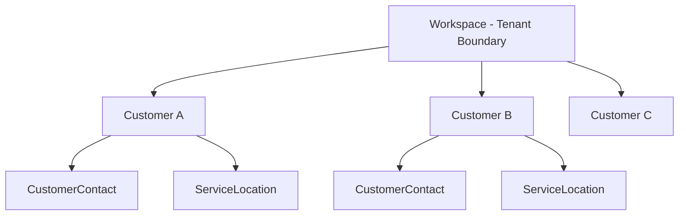
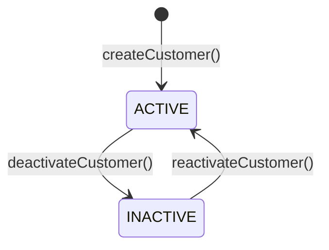
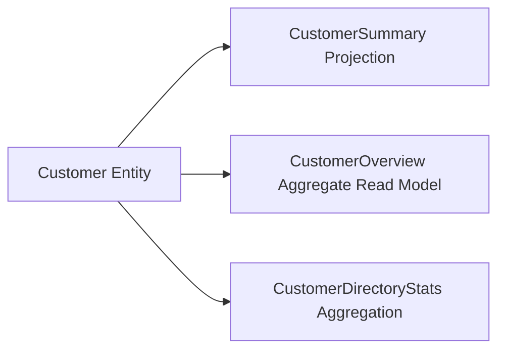

# Aforden Architecture Specification
## Phase 1.4.1 — Customer Domain Architecture

**Domain**: Customer & Service Location  
**Phase**: 1.4.1 (Architecture Definition)  
**Status**: ACTIVE CONTRACT  
**Compatibility**: Aforden Core Architecture (Phases 1.1 — 1.3.23)

---

## 1. Customer Domain Purpose

The **Customer Domain** is the core commercial boundary within Aforden that manages external client accounts, organizations, businesses, and individuals that contract with or receive field services from an Aforden tenant workspace.

### Core Responsibilities
- **Commercial Counterparty**: Represents the external organization or client paying for or receiving field services.
- **Relational Anchor**: Acts as the parent root for operational field service relationships, including customer contacts and service locations.
- **Audit & Operational Tracking**: Maintains historical business records across work requests, work orders, service histories, invoicing, and equipment tracking.
- **Tenant Scoping**: Enforces strict multi-tenant boundary constraints such that each customer profile is strictly owned by and isolated within a single `Workspace`.

---

## 2. Customer Definition

A **Customer** is defined as an external business, commercial client, residential property owner, or organization that engages the workspace's workforce to perform field service work.

- A Customer is an external legal or operational counterparty.
- A Customer is NOT an internal workspace actor, staff member, system account, or technician.
- A Customer serves as the conceptual "WHO" in the field service execution model:

```text
  Customer (WHO) ──────> CustomerContact (PERSON) ──────> ServiceLocation (WHERE)
```

---

## 3. Core Domain Distinctions (Customer vs Internal Actors)

Aforden maintains strict semantic and relational separation between external customer entities and internal organization/system identities. The following table establishes this architectural contract:

| Domain Entity | Archetype | Authentication / Login | Tenant Role | Operational Scope |
| :--- | :--- | :--- | :--- | :--- |
| **`User`** | Global Account | Yes (Email + Password/OAuth) | None (Global) | Authentication identity and global credentials |
| **`WorkspaceMember`** | Tenant Association | Inherited from User | `OWNER`, `ADMIN`, `MANAGER`, `DISPATCHER`, `TECHNICIAN`, `ACCOUNTANT` | RBAC and tenancy membership |
| **`Employee`** | Internal Worker | Linked via WorkspaceMember | Internal staff | Internal HR, department, job title, organizational hierarchy |
| **`TechnicianProfile`**| Field Operative | Via Employee/WorkspaceMember | Field execution | Operational capabilities, skills, service areas, availability, assignments |
| **`Customer`** | **External Client** | **No** (External entity) | **None** (Commercial client) | **WHO receives services and commercial billing** |

### Key Architectural Invariants
1. A `Customer` is **NEVER** an authentication identity (`User`).
2. A `Customer` is **NEVER** an internal organizational worker (`Employee`).
3. A `Customer` is **NEVER** a field operative (`TechnicianProfile`).
4. A `Customer` has **NO** access to internal workspace RBAC or management dashboards.

---

## 4. Workspace Ownership & Tenant Model

Every Customer belongs to exactly one `Workspace`. The existing `Workspace` model is the absolute tenant boundary.



### Tenancy Principles
- **No Global Customers**: There is no cross-workspace customer sharing.
- **No Secondary Ownership**: Customers are owned directly by `Workspace`, not by an `Organization` model or `Employee`.
- **Foreign Key Constraint**: Every Customer record must have a mandatory non-nullable `workspaceId` referencing `Workspace.id`.
- **Cascade Behavior**: If a Workspace is deleted, all owned Customers cascade delete cleanly.

---

## 5. Customer Identity: Technical vs Business Identity

The architecture explicitly decouples technical database identity from operational business identity:

```text
┌─────────────────────────────────────────────────────────────┐
│ Customer Entity Identity                                    │
├──────────────────────────────┬──────────────────────────────┤
│ Internal Technical Identity  │ Business Operational Identity│
│ • Field: id                  │ • Field: customerNumber      │
│ • Type: CUID (string)        │ • Type: String               │
│ • Purpose: Relational PK/FK  │ • Purpose: Human reference   │
│ • Immutable & Opaque         │ • Workspace-scoped unique    │
└──────────────────────────────┴──────────────────────────────┘
```

### Specifications
- **`id` (Technical Identity)**:
  - System-generated CUID.
  - Used for database joins, foreign keys, API internal routes, and relational integrity.
  - Immutable across the entire lifecycle of the record.
- **`customerNumber` (Business Identity)**:
  - Human-readable alphanumeric string (e.g., `CUST-10001`).
  - Used on invoices, work orders, dispatcher search inputs, and customer communications.
  - Enforces workspace-scoped uniqueness (`@@unique([workspaceId, customerNumber])`).

---

## 6. Customer Number Concept & Numbering Rules

1. **Workspace Scope**: Uniqueness is strictly scoped to the tenant workspace (`@@unique([workspaceId, customerNumber])`). Two different workspaces may have customer number `CUST-001` without conflict.
2. **Format & Human Readability**: Must be suitable for voice dispatch, search queries, printed work orders, and billing invoices.
3. **Stability**: Once assigned, customer numbers must not arbitrarily change during normal operation.
4. **Deferred Implementation**: The specific generation algorithm (sequential, prefix-based, or customizable) is deferred to the service implementation phase (Phase 1.4.3+).

---

## 7. Customer Lifecycle

Customer lifecycle management is explicit, predictable, and audited. The domain prohibits arbitrary uncontrolled status mutations.



### Lifecycle States
- **`ACTIVE`**: The customer is in good standing. New service locations, customer contacts, work requests, and work orders can be created and dispatched.
- **`INACTIVE`**: The customer is suspended, archived, or churned. Existing historical records remain intact and readable, but initiating new operational workflows (e.g. creating new work orders) is blocked.

---

## 8. Customer Status Concept

The status is represented by a dedicated enum:

```prisma
enum CustomerStatus {
  ACTIVE
  INACTIVE
}
```

### Status Rules
- Defaults to `ACTIVE` upon creation.
- Transitions must be executed through dedicated domain services (`changeCustomerStatus`) rather than ad-hoc updates.
- Status filters must be supported on all customer query endpoints and read models.

---

## 9. Deletion Strategy & Historical Integrity

Customer records become heavily referenced across operational field service entities:

```text
Customer
   ├── CustomerContact
   ├── ServiceLocation
   ├── WorkRequest (Future)
   ├── WorkOrder (Future)
   ├── ServiceHistory (Future)
   ├── Invoicing / Billing (Future)
   └── TechnicianAssignment (Future)
```

### Core Architecture Deletion Principles
1. **Historical Preservation**: Destructive hard deletion (`DELETE FROM Customer`) is strictly prohibited once a customer has associated operational history (work orders, invoices, or service locations).
2. **Operational Deactivation**: Retirement of customers is performed via status transition (`CustomerStatus.INACTIVE`).
3. **Clean-State Removal**: Hard deletion is only permissible if a customer was created erroneously and has zero downstream operational references.
4. **Referential Integrity**: Future operational models referencing `Customer` will use `onDelete: Restrict` or `onDelete: SetNull` to prevent accidental cascading data loss of historical financial or operational records.

---

## 10. Customer Aggregate Boundary

The Customer domain encapsulates the following conceptual aggregate:

```text
Customer Aggregate Root
├── id (Technical PK)
├── workspaceId (Tenant FK)
├── customerNumber (Business Identifier)
├── name (Commercial Name / Legal Entity)
├── email (General contact email)
├── phone (General contact telephone)
├── website (Corporate URL)
├── addressLine1
├── addressLine2
├── city
├── state
├── postalCode
├── country
├── status (ACTIVE / INACTIVE)
├── notes (Operational / Account notes)
├── createdAt (Audit timestamp)
└── updatedAt (Audit timestamp)
```

### Decoupled Service Architecture
Although `CustomerContact` and `ServiceLocation` are conceptually associated with the customer, Aforden explicitly rejects a monolithic single-service design. The domain will be split into modular, decoupled service boundaries:
1. **`Customer Service`**: Manages customer lifecycle, profile, and business metadata.
2. **`Customer Contact Service`**: Manages associated contact persons, roles, and direct communications.
3. **`Service Location Service`**: Manages physical sites, geolocation, access notes, and dispatch areas.

---

## 11. Customer Contact Relationship (`CustomerContact`)

```text
Customer (1) ──────< (N) CustomerContact
```

- **Definition**: Represents a specific human individual associated with the customer organization (e.g., Facility Manager, Accounting Lead, Site Superintendent).
- **Attributes**: Full Name, Title/Role, Direct Email, Direct Phone, IsPrimary flag, Notes.
- **Semantics**: Answers the question **"WHO do we speak with at this customer?"**

---

## 12. Service Location Relationship (`ServiceLocation`)

```text
Customer (1) ──────< (N) ServiceLocation
```

- **Definition**: Represents a physical geographical site, facility, campus, or building where field technicians perform work.
- **Attributes**: Location Name, Street Address, City, State, Postal Code, Country, Geolocation Coordinates (lat/long), Access Codes/Instructions, ServiceArea link.
- **Semantics**: Answers the question **"WHERE is the work physically executed?"**

---

## 13. Future Service Boundaries & Method Contracts

The upcoming Customer service layer (Phase 1.4.3+) will implement the following service contract:

```typescript
// --- Customer Core Services (Phase 1.4.3+) ---

interface CreateCustomerInput {
    workspaceId: string;
    name: string;
    customerNumber?: string;
    email?: string;
    phone?: string;
    website?: string;
    addressLine1?: string;
    addressLine2?: string;
    city?: string;
    state?: string;
    postalCode?: string;
    country?: string;
    notes?: string;
}

interface UpdateCustomerInput {
    name?: string;
    customerNumber?: string;
    email?: string;
    phone?: string;
    website?: string;
    addressLine1?: string;
    addressLine2?: string;
    city?: string;
    state?: string;
    postalCode?: string;
    country?: string;
    notes?: string;
}

// Service Method Signatures:
// createCustomer(ctx: WorkspaceAuthorizationContext, data: CreateCustomerInput): Promise<Customer>
// getCustomer(ctx: WorkspaceAuthorizationContext, customerId: string): Promise<Customer>
// getCustomerByNumber(ctx: WorkspaceAuthorizationContext, customerNumber: string): Promise<Customer>
// getCustomers(ctx: WorkspaceAuthorizationContext, query: CustomerQueryFilters): Promise<PaginatedCustomers>
// updateCustomer(ctx: WorkspaceAuthorizationContext, customerId: string, data: UpdateCustomerInput): Promise<Customer>
// changeCustomerStatus(ctx: WorkspaceAuthorizationContext, customerId: string, status: CustomerStatus, reason?: string): Promise<Customer>
// getCustomerStats(ctx: WorkspaceAuthorizationContext, customerId: string): Promise<CustomerStatistics>
```

---

## 14. Read-Model Boundary (Projections vs Write Models)

Raw Prisma database models must not be exposed directly to API consumers. The Customer domain enforces a strict separation between command/write models and query/read models.



### Projections & Read Models
1. **`CustomerSummary` / `CustomerListItem`**:
   - Lightweight projection designed for fast listing, autocomplete search, and dropdown pickers.
   - Includes: `id`, `customerNumber`, `name`, `status`, `city`, `phone`.
2. **`CustomerOverview`**:
   - Rich aggregated view for customer detail dashboards.
   - Includes: Full customer profile, primary contact summary, count of active service locations, count of open work orders, and operational readiness indicators.
3. **`CustomerDirectoryStats`**:
   - Workspace-level aggregate metric model.
   - Includes: Total customers, active customer count, inactive customer count, recent customer additions.

---

## 15. RBAC & Authorization Boundary

The Customer domain integrates directly into Aforden's established authorization framework (`lib/services/authorization/`).

### Permission Mappings
The following permissions are already codified in `PERMISSIONS`:
- `CUSTOMERS_VIEW` (`customers.view`): Allows viewing customer records, directories, and profiles.
- `CUSTOMERS_CREATE` (`customers.create`): Allows creating new customer records.
- `CUSTOMERS_UPDATE` (`customers.update`): Allows editing customer details and lifecycle statuses.
- `CUSTOMERS_DELETE` (`customers.delete`): Allows archiving or deleting customer records.

### Role Authorization Matrix

| Role | `customers.view` | `customers.create` | `customers.update` | `customers.delete` |
| :--- | :---: | :---: | :---: | :---: |
| **OWNER** | Allowed | Allowed | Allowed | Allowed |
| **ADMIN** | Allowed | Allowed | Allowed | Allowed |
| **MANAGER** | Allowed | Allowed | Allowed | Denied |
| **DISPATCHER** | Allowed | Allowed | Allowed | Denied |
| **TECHNICIAN** | Allowed | Denied | Denied | Denied |
| **ACCOUNTANT** | Allowed | Denied | Denied | Denied |

All operations must be guarded using `requirePermission(ctx, PERMISSIONS.CUSTOMERS_*)` and `assertWorkspaceResource(ctx, customer.workspaceId)`.

---

## 16. Multi-Layer Tenant Isolation Requirements

Tenant isolation is mandatory at every layer of the architecture:

```text
1. API Route Layer        → Validates active session and resolves authorized Workspace
        ↓
2. Authorization Layer    → Verifies Workspace membership and required RBAC permission
        ↓
3. Service Layer          → Enforces assertWorkspaceResource(ctx, resource.workspaceId)
        ↓
4. Data Access Layer      → Injects where: { id: customerId, workspaceId: authorizedWorkspaceId }
        ↓
5. Transitive Isolation   → Child queries (Contacts/Locations) MUST filter or join on workspaceId
```

### Transitive Isolation Rule
When retrieving a `CustomerContact` or `ServiceLocation`, the query must verify that the parent `Customer` belongs to the requesting workspace:
```typescript
// Conceptual isolation query:
const location = await prisma.serviceLocation.findFirst({
    where: {
        id: locationId,
        customer: {
            workspaceId: authorizedWorkspaceId,
        },
    },
});
```
Cross-workspace data access attempts must throw `WorkspaceAccessDeniedError` or return `null`/404 to avoid leaking resource existence.

---

## 17. Domain Dependency Direction

Domain dependencies must remain strictly unidirectional and hierarchical to prevent circular coupling:

```text
Workspace (Tenant Root)
   ↓
Customer (Commercial Account)
   ├── CustomerContact (Contact Person)
   └── ServiceLocation (Physical Site)
         ↓
[Downstream Domains (Future Phases)]
   ├── WorkRequest
   ├── WorkOrder
   ├── Scheduling & Dispatch
   ├── Billing & Invoices
   └── Inventory & Asset Tracking
```

### Invariant Rules
- The Customer domain **NEVER** imports or depends on downstream domains (WorkOrder, Dispatch, Scheduling, Billing, Inventory).
- Downstream domains reference `Customer` and `ServiceLocation` via explicit foreign keys.

---

## 18. Explicit Exclusions from Phase 1.4.1

To maintain strict phase hygiene, the following items are explicitly **EXCLUDED** from Phase 1.4.1:
- ❌ No Prisma Customer schema modification.
- ❌ No database migrations generated or executed.
- ❌ No runtime service files in `lib/services/customer/`.
- ❌ No API route handlers in `app/api/`.
- ❌ No Zod schemas in `lib/validations/`.
- ❌ No frontend UI components, hooks, or pages.
- ❌ No modifications to existing Phase 1.2 or Phase 1.3 models/services.

---

## 19. Compatibility with Existing Phase 1.1–1.3 Architecture

- **Zero Breaking Changes**: The Customer domain architecture integrates seamlessly with the existing database schema and service layers.
- **Tenant Alignment**: Direct 1:N alignment with `Workspace` ensures consistency with `Organization`, `Employee`, `Department`, `JobTitle`, and `TechnicianProfile`.
- **RBAC Continuity**: Utilizes existing `lib/services/authorization/` mechanisms with zero modifications needed to core auth infrastructure.
- **Test Integrity**: Full compatibility with all existing 40 test suites (834 tests).

---

## 20. Dependencies & Target Roadmap for Phase 1.4.2

Phase 1.4.1 is complete upon approval of this architectural specification. The immediate next phase is:

### Phase 1.4.2 — Customer Prisma Model & Schema Integration
- **Target Deliverables**:
  1. Add `enum CustomerStatus { ACTIVE, INACTIVE }` to `prisma/schema.prisma`.
  2. Add `model Customer` to `prisma/schema.prisma` with:
     - `id String @id @default(cuid())`
     - `workspaceId String`
     - `customerNumber String?`
     - `name String`
     - `email String?`, `phone String?`, `website String?`
     - Address fields (`addressLine1`, `addressLine2`, `city`, `state`, `postalCode`, `country`)
     - `status CustomerStatus @default(ACTIVE)`
     - `notes String? @db.Text`
     - Timestamps (`createdAt`, `updatedAt`)
     - Relations: `workspace Workspace @relation(...)`
     - Unique constraints: `@@unique([workspaceId, customerNumber])`
     - Indexes: `@@index([workspaceId])`, `@@index([status])`, `@@index([name])`
  3. Update `Workspace` model to include `customers Customer[]`.
  4. Generate updated Prisma client (`npx prisma generate`).
  5. Add model-level unit tests for schema structure and constraint compliance.

---

*Architectural Contract Approved & Codified for Phase 1.4.1.*
