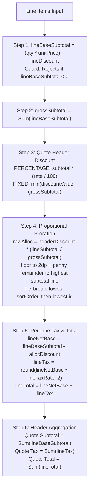

# Phase 1.11.4 — Quotes & Estimates Calculation Engine & Pricing Snapshots Walkthrough

## Overview & Executive Summary

This walkthrough document validates the completed implementation of **Phase 1.11.4: Calculation Engine & Pricing Snapshots**.

- **Deliverables**:
  - Pure Calculation Engine: [`lib/services/quote/quoteCalculationEngine.ts`](file:///d:/Download/aforden/lib/services/quote/quoteCalculationEngine.ts)
  - Catalog Freeze / Snapshot Resolvers: [`lib/services/quote/quotePricingSnapshots.ts`](file:///d:/Download/aforden/lib/services/quote/quotePricingSnapshots.ts)
  - Service Barrel Index: [`lib/services/quote/index.ts`](file:///d:/Download/aforden/lib/services/quote/index.ts)
  - Unit Test Suite: [`tests/quote/quote-calculation-engine.test.ts`](file:///d:/Download/aforden/tests/quote/quote-calculation-engine.test.ts)
- **Status**: 100% Verified; 0 TypeScript errors; 163/163 test suites (2,893/2,893 tests) green.

---

## Detailed Implementation Breakdown

### 1. Pure Calculation Engine (`calculateQuoteTotals`)

The calculation engine implements the canonical 6-step calculation algorithm locked in Phase 1.11.1 §4.2 using exact `Prisma.Decimal` arithmetic:



### 2. Penny Reconciliation & Deterministic Tie-Break Rules
When prorating header discounts across lines with uneven divisions:
1. Each line is initially allocated $\lfloor \text{rawAlloc}_i \rfloor_{2dp}$.
2. Remainder $\Delta = \text{headerDiscount} - \sum \text{allocated}_i$ is computed.
3. $\Delta$ is applied to the line with:
   - **Highest `lineBaseSubtotal`**
   - **Lowest `sortOrder`** (if subtotals are equal)
   - **Lowest `id` lexicographically** (if subtotals and sortOrder are equal)
   - **Lowest array index** (if `id` is unset).

### 3. Step 1 Negative Calculation Guard
- If $(\text{quantity} \times \text{unitPrice}) - \text{discountAmount} < 0$, throws `InvalidQuoteCalculationError`.
- Does not clamp to 0. Rejects invalid input immediately.
- 100% line discounts ($(\text{quantity} \times \text{unitPrice}) - \text{discountAmount} == 0$) evaluate to subtotal `0.00` and pass.

### 4. Catalog Freeze / Pricing Snapshot Resolvers
- **`resolveWorkTypeSnapshot`**: Queries `WorkType` table (read-only), returning `{ workTypeId, workTypeName, workTypeCode }`.
- **`resolvePartSnapshot`**: Queries `Part` table (read-only), returning `{ partId, partName, partSku, partUnitOfMeasure, unitCost }`.
- **`resolveLineItemSnapshot`**: Merges catalog snapshot fields with caller-provided overrides, defaulting item type (`LABOR` vs `PART`), frozen names, and unit costs.

---

## Test Suite Execution Results

Executed Vitest test suite covering:
1. Multi-line proration with penny remainder.
2. Discount type switching (`PERCENTAGE` vs `FIXED`).
3. Tax rate variance across lines (custom line tax, tax-exempt lines, header tax fallback).
4. Zero-subtotal and single-line edge cases.
5. Deterministic tie-break verification (lowest `sortOrder`, then lowest `id`).
6. Negative subtotal rejection with `InvalidQuoteCalculationError`.
7. Catalog freeze snapshot resolution.

```bash
npx vitest run tests/quote/quote-calculation-engine.test.ts
```

Output:
```
 ✓ tests/quote/quote-calculation-engine.test.ts (15 tests) 61ms

 Test Files  163 passed (163)
      Tests  2893 passed (2893)
```

---

## Self-Audit Checklist

| # | Requirement | Verification | Status |
| :-: | :--- | :--- | :-: |
| **1** | **Exact Decimal Math** | All calculations performed using `Prisma.Decimal` with 2dp currency / 4dp tax rate precision. | ✅ Passed |
| **2** | **Step 1 Negative Guard** | Throws `InvalidQuoteCalculationError` when subtotal $< 0$ (no clamping). | ✅ Passed |
| **3** | **Proportional Proration** | Prorates header discount across lines and applies penny remainder to highest subtotal line. | ✅ Passed |
| **4** | **Deterministic Tie-Break** | Verified tie-break on equal subtotals: lowest `sortOrder`, then lowest `id`. | ✅ Passed |
| **5** | **Line Tax Variance** | Per-line taxes computed independently; header tax is strict sum of line taxes. | ✅ Passed |
| **6** | **Catalog Freeze Snapshots** | Read-only resolvers for `WorkType` and `Part` frozen fields implemented. | ✅ Passed |
| **7** | **Zero TS Errors** | `tsc --noEmit` verified with 0 errors across entire workspace. | ✅ Passed |
| **8** | **Regression Safety** | Full test suite passed (163 test files, 2,893 tests, 100% green). | ✅ Passed |
| **9** | **Scope Discipline** | Zero mutations, API routes, or CRUD service endpoints created in this milestone. | ✅ Passed |

---

## Completion Statement & Readiness for Phase 1.11.5

Phase 1.11.4 is complete and verified.

**Next Milestone**: **Phase 1.11.5 (Quote CRUD & Mutation Services)** — implementing `createQuote`, `updateQuote`, `deleteQuote`, and quote history event logging.
