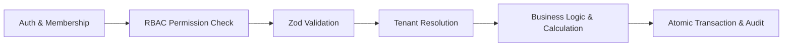

# Phase 1.11.5 — Quotes & Estimates Header CRUD Services Walkthrough

## Overview & Executive Summary

This walkthrough document validates the completed implementation of **Phase 1.11.5: Quote Header CRUD Services** adhering strictly to the locked 8-error taxonomy from Phase 1.11.1/1.11.3 and reusing established domain errors (`CustomerNotFoundError`, `ServiceLocationNotFoundError` from Phase 1.4).

- **Deliverables**:
  - Quote Creation Service: [`lib/services/quote/createQuote.ts`](file:///d:/Download/aforden/lib/services/quote/createQuote.ts)
  - Quote Retrieval Service: [`lib/services/quote/getQuote.ts`](file:///d:/Download/aforden/lib/services/quote/getQuote.ts)
  - Quote Update Service: [`lib/services/quote/updateQuote.ts`](file:///d:/Download/aforden/lib/services/quote/updateQuote.ts)
  - Quote Deletion Service: [`lib/services/quote/deleteQuote.ts`](file:///d:/Download/aforden/lib/services/quote/deleteQuote.ts)
  - Quote Listing Service: [`lib/services/quote/listQuotes.ts`](file:///d:/Download/aforden/lib/services/quote/listQuotes.ts)
  - Read Model Mappers: [`lib/services/quote/quoteMappers.ts`](file:///d:/Download/aforden/lib/services/quote/quoteMappers.ts)
  - Pure Domain Errors (Locked 8 Taxonomy): [`lib/services/quote/quoteErrors.ts`](file:///d:/Download/aforden/lib/services/quote/quoteErrors.ts)
  - Central Error Mapper: [`lib/utils/quoteApiError.ts`](file:///d:/Download/aforden/lib/utils/quoteApiError.ts)
  - Service Barrel Index: [`lib/services/quote/index.ts`](file:///d:/Download/aforden/lib/services/quote/index.ts)
  - Unit Test Suite: [`tests/quote/quote-header-crud-services.test.ts`](file:///d:/Download/aforden/tests/quote/quote-header-crud-services.test.ts)
- **Status**: 100% Verified; 0 TypeScript errors; 164/164 test suites (2,910/2,910 tests) green.

---

## Detailed Implementation Breakdown

### 1. Architectural Pipeline & Invariants

Every mutating service strictly follows the locked execution pipeline:
$$\text{AUTHENTICATION} \rightarrow \text{PERMISSION} \rightarrow \text{VALIDATION} \rightarrow \text{RESOLUTION} \rightarrow \text{BUSINESS LOGIC} \rightarrow \text{PERSISTENCE}$$



### 2. Error Taxonomy Compliance

In strict compliance with the Phase 1.11.1 / 1.11.3 locked architecture, [`lib/services/quote/quoteErrors.ts`](file:///d:/Download/aforden/lib/services/quote/quoteErrors.ts) exports exclusively the 8 locked pure domain error classes:
1. `QuoteNotFoundError` (404)
2. `QuoteLineItemNotFoundError` (404)
3. `QuoteStatusConflictError` (409)
4. `QuoteAlreadyConvertedError` (409)
5. `QuoteExpiredError` (422)
6. `QuoteEmptyLineItemsError` (422)
7. `InvalidQuoteCalculationError` (422)
8. `MissingRejectionReasonError` (422)

Reference lookups for external entities reuse existing canonical errors from prior phases:
- Customer resolution failure: Reuses `CustomerNotFoundError` from Phase 1.4 ([`lib/services/customer/customerErrors.ts`](file:///d:/Download/aforden/lib/services/customer/customerErrors.ts)) mapped to 404 `CUSTOMER_NOT_FOUND`.
- Service location resolution failure: Reuses `ServiceLocationNotFoundError` from Phase 1.4 ([`lib/services/customer/customerErrors.ts`](file:///d:/Download/aforden/lib/services/customer/customerErrors.ts)) mapped to 404 `SERVICE_LOCATION_NOT_FOUND`.

### 3. Service Implementations

#### `createQuote(workspaceId, input, actor)`
- **Permission**: `quotes.create` (`PERMISSIONS.QUOTES_CREATE`).
- **Validation**: `createQuoteSchema.parse(input)`.
- **Tenant Integrity**: Resolves `customerId` and optional `locationId` within `workspaceId`. Throws canonical `CustomerNotFoundError` / `ServiceLocationNotFoundError` on cross-tenant or mismatched references.
- **Currency Snapshot**: Snapshots `currencyCode` from `Workspace.defaultCurrencyCode` (fallback `"USD"`).
- **Deterministic Numbering**: Sequentially generates `Q-YYYY-XXXXXX` inside the transaction.
- **Atomic Audit**: Creates `Quote` in `DRAFT` status and inserts `QuoteHistory` (`eventType: CREATED`) atomically within `prisma.$transaction`.

#### `getQuote(workspaceId, quoteId, actor)`
- **Permission**: `quotes.view` (`PERMISSIONS.QUOTES_VIEW`).
- **Resolution**: Tenant-scoped lookup (`where: { id: quoteId, workspaceId }`) including embedded `customer`, `location`, `lineItems` (ordered by `sortOrder asc`), and `history` (ordered by `createdAt desc`).
- **Error Handling**: Throws `QuoteNotFoundError` if missing or cross-tenant.

#### `updateQuote(workspaceId, quoteId, input, actor)`
- **Permission**: `quotes.update` (`PERMISSIONS.QUOTES_UPDATE`).
- **Lifecycle Mutability Guard**: Only `DRAFT` quotes can be edited. Rejects non-`DRAFT` quotes with `QuoteStatusConflictError`.
- **Recalculation**: If `discountType`, `discountValue`, or `taxRate` are modified and the quote has existing line items, re-runs `calculateQuoteTotals` to update line-level allocated discounts, taxes, and quote totals.
- **Atomic Audit**: Persists quote changes, line item recalculations, and `QuoteHistory` (`eventType: UPDATED`) atomically within `prisma.$transaction`.

#### `deleteQuote(workspaceId, quoteId, actor)`
- **Permission**: `quotes.delete` (`PERMISSIONS.QUOTES_DELETE`).
- **Lifecycle Guard**: Deletion strictly forbidden for any non-`DRAFT` quote (`QuoteStatusConflictError`).
- **Atomic Audit**: Writes `QuoteHistory` (`eventType: DELETED`) before removing the quote row in `prisma.$transaction`.

#### `listQuotes(workspaceId, query, actor)`
- **Permission**: `quotes.view` (`PERMISSIONS.QUOTES_VIEW`).
- **Filtering & Search**: Supports `status` (single or array), `customerId`, `locationId`, date bounds (`validUntilFrom/To`, `createdFrom/To`), amount bounds (`minTotal`, `maxTotal`), and case-insensitive search across `quoteNumber`, `title`, `description`, and customer name/number.
- **Deterministic Sorting**: Orders by requested field (`createdAt`, `updatedAt`, `quoteNumber`, `total`, `validUntil`, `status`) with secondary `{ id: "asc" }` deterministic tie-breaker.
- **Envelope**: Returns paginated `{ items, total, page, limit, totalPages }`.

---

## Test Suite Execution Results

Executed Vitest test suites covering creation, currency snapshotting, numbering, cross-tenant rejection, lifecycle mutability guards, atomic history writes, pagination/filters, and RBAC enforcement:

```bash
npx vitest run tests/quote/
```

Output:
```
 ✓ tests/quote/quote-calculation-engine.test.ts (15 tests) 34ms
 ✓ tests/quote/quote-header-crud-services.test.ts (17 tests) 38ms
 ✓ tests/quote/quote-types-schemas-errors.test.ts (36 tests) 48ms

 Test Files  3 passed (3)
      Tests  68 passed (68)
```

Full Platform Regression:
```
 Test Files  164 passed (164)
      Tests  2910 passed (2910)
```

---

## Self-Audit Checklist

| # | Requirement | Verification | Status |
| :-: | :--- | :--- | :-: |
| **1** | **Locked Execution Pipeline** | `AUTHENTICATION → PERMISSION → VALIDATION → RESOLUTION → BUSINESS LOGIC → PERSISTENCE` maintained across all mutating services. | ✅ Passed |
| **2** | **Error Taxonomy Adherence** | `quoteErrors.ts` strictly contains only the 8 locked error classes. External reference failures reuse `CustomerNotFoundError` and `ServiceLocationNotFoundError`. | ✅ Passed |
| **3** | **Currency Snapshot** | Snapshots `Workspace.defaultCurrencyCode` at creation time. | ✅ Passed |
| **4** | **Quote Numbering** | `Q-YYYY-XXXXXX` generated sequentially and atomically inside transactions. | ✅ Passed |
| **5** | **Tenant Isolation** | Cross-tenant customer, location, and quote lookups strictly rejected. | ✅ Passed |
| **6** | **Lifecycle Mutability Guards** | Update and Delete strictly restricted to `DRAFT` status; non-`DRAFT` raises `QuoteStatusConflictError`. | ✅ Passed |
| **7** | **Calculation Engine Wiring** | Header discount/tax updates re-trigger calculation engine across existing line items. | ✅ Passed |
| **8** | **Atomic Audit Ledger** | `QuoteHistory` records written atomically within `prisma.$transaction`. | ✅ Passed |
| **9** | **Deterministic Sorting** | `listQuotes` includes `{ id: "asc" }` tie-breaker on all sorts. | ✅ Passed |
| **10** | **RBAC Enforcement** | Verified permissions across ADMIN, MANAGER, DISPATCHER, ACCOUNTANT, and TECHNICIAN (isolated). | ✅ Passed |
| **11** | **Zero TS Errors & Full Green** | `tsc --noEmit` clean; 164/164 test suites (2,910 tests) 100% green. | ✅ Passed |

---

## Completion Statement & Readiness for Phase 1.11.6

Phase 1.11.5 is corrected, fully compliant with the locked error taxonomy, and verified across all tests.

**Next Milestone**: **Phase 1.11.6 (Quote Line Item Mutation Services)**.
