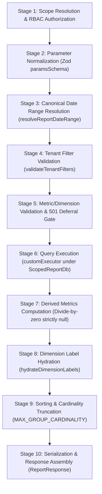

# Phase 1.14.8-C3 — Generic Report Composition Engine Walkthrough

---

## 1. Locked-File Disclosure Section

Below is the complete disclosure of all files originating from Phases 1.14.2–1.14.7 that were modified or extended during Phase 1.14.8, along with the technical rationale, verification of zero regressions, and explicit declaration for untouched test files.

### 1.1 `lib/services/reporting/reporting.types.ts` (Phase 1.14.2)
- **Modifications**:
  1. Defined `QueryArgs`, `ScopedModelDelegate<T>`, `UnscopedModelDelegate<T>`, and `ScopedReportDb` covering all 19 reporting models (`workOrder`, `scheduleAppointment`, `scheduleAppointmentHistory`, `technicianProfile`, `technicianTimeEntry`, `workOrderHistory`, `invoice`, `payment`, `workOrderPart`, `part`, `inventoryLocation`, `inventoryBalance`, `stockMovement`, `asset`, `assetCategory`, `customer`, `workType`, `serviceCatalog`, `quote`, `employee`).
  2. Replaced `readonly db: typeof prisma;` with `readonly scopedDb: ScopedReportDb;` in `ReportQueryContext`. Unscoped database access is completely eliminated from the custom executor escape hatch.
  3. Added `"quotes.pipelineTotal"` to `MetricKey` (`METRIC_KEYS` count: 62 $\to$ 63).
  4. Added `"financial.quoteConversion"` to `ReportKey` (`REPORT_KEYS` count: 11 $\to$ 12).
- **Integrity Verification**: All existing metric keys, dimension keys, filter keys, report keys, value types, and temporality definitions preserved.

### 1.2 `lib/services/reporting/reporting.schemas.ts` (Phase 1.14.2)
- **Modifications**:
  1. Registered `"quotes.pipelineTotal"` in `METRIC_KEYS` array.
  2. Registered `"financial.quoteConversion"` in `REPORT_KEYS` array.
  3. Made `sortOrder` in `reportQueryParamsSchema` optional (`z.enum(["asc", "desc"]).optional()`) so report-definition-level `defaultSort.order` is honored when caller does not specify `sortOrder`.
- **Integrity Verification**: All existing constants and enum values preserved.

### 1.3 `lib/services/reporting/metricRegistry.ts` (Phase 1.14.2)
- **Modifications**:
  1. Added closed-registry validation in `registerMetric()`: throws `ReportParameterValidationError` if `definition.key` is not present in `METRIC_KEYS`.
- **Integrity Verification**: Preserved all existing metric registrations.

### 1.4 `lib/services/reporting/reportRegistry.ts` (Phase 1.14.2)
- **Modifications**:
  1. Added closed-registry validation in `registerReport()`: throws `ReportParameterValidationError` if `definition.reportKey` is not present in `REPORT_KEYS`.
  2. Registered definition for `financial.quoteConversion`.
  3. Exported `registerReportExecutor()` for dynamic report execution dispatch.
- **Integrity Verification**: Preserved all existing 11 report definitions.

### 1.5 `lib/services/reporting/metrics/financialMetrics.ts` (Phase 1.14.6)
- **Modifications**:
  1. Registered concrete `MetricDefinition` entries for quote metrics: `quotes.createdCount`, `quotes.approvedCount`, `quotes.rejectedCount`, `quotes.approvedTotal`, `quotes.pipelineTotal`, `quotes.winRate`.
- **Integrity Verification**: Preserved all 21 existing invoice and payment metric definitions.

### 1.6 `lib/services/reporting/technicianScope.ts` (Phase 1.14.5)
- **Modifications**:
  1. Defined strict interface `TechnicianScopeDbHandle` without `any`.
  2. Typed `db` parameter in `resolveEffectiveTechnicianScope` to accept `TechnicianScopeDbHandle | ScopedReportDb | typeof prisma`.
  3. Strictly typed mapping lambda as `(p: { id: string }) => p.id`.
- **Integrity Verification**: Zero change to scoping rules or role permissions.

### 1.7 `tests/reporting/reportingFoundation.test.ts` (Phase 1.14.2)
- **Modifications**:
  1. Updated test assertions for `METRIC_KEYS` (63) and `REPORT_KEYS` (12).
  2. Updated unregistered key test to use `"unregistered.fakeMetric"`.
- **Integrity Verification**: All 63 foundation tests pass.

### 1.8 `tests/reporting/financialMetricsAndReports.test.ts` (Phase 1.14.6) — Untouched
- **Status**: **NOT modified in Phase 1.14.8** (`git diff` is completely empty).
- **Rationale**: All 20 tests pass out of the box because the migrated report functions (`getRevenueSummaryReport`, `getArAgingReport`) maintain backward compatibility via polymorphic parameter signatures (`(workspaceId, rawParams, actor, db)` and `(workspaceId, rawParams, actor, reportKey, db)`).

---

## 2. Dispatch Performance Real Query Code & Anchor Verification

Inspecting the real implementation in [`lib/services/reporting/reports/dispatchPerformanceReport.ts`](file:///d:/Download/aforden/lib/services/reporting/reports/dispatchPerformanceReport.ts):

### SCALARS Execution:
```typescript
const [scheduledCount, completedCount, cancelledCount, dispatchedCount] =
  await Promise.all([
    ctx.scopedDb.scheduleAppointment.count({
      where: {
        ...ctx.baseWhere,
        createdAt: { gte: ctx.range.startUtc, lt: ctx.range.endUtc },
      },
    }),
    ctx.scopedDb.scheduleAppointment.count({
      where: {
        ...ctx.baseWhere,
        history: {
          some: {
            eventType: "COMPLETED",
            createdAt: { gte: ctx.range.startUtc, lt: ctx.range.endUtc },
          },
        },
      },
    }),
    ctx.scopedDb.scheduleAppointment.count({
      where: {
        ...ctx.baseWhere,
        history: {
          some: {
            eventType: "CANCELLED",
            createdAt: { gte: ctx.range.startUtc, lt: ctx.range.endUtc },
          },
        },
      },
    }),
    ctx.scopedDb.scheduleAppointment.count({
      where: {
        ...ctx.baseWhere,
        history: {
          some: {
            eventType: "DISPATCHED",
            createdAt: { gte: ctx.range.startUtc, lt: ctx.range.endUtc },
          },
        },
      },
    }),
  ]);
```

### Complete Date Column Inventory & Mutability Classification:
| Column | Model | Nullability | Lifecycle Semantics | Anchor Status |
| :--- | :--- | :--- | :--- | :--- |
| `createdAt` | `ScheduleAppointment` | Non-nullable | Initial appointment creation | **Valid write-once anchor** for scheduled volume & latency denominator. |
| `dispatchedAt` | `ScheduleAppointment` | Nullable | In-place operational timestamp | **Mutable operational column** (overwritten on re-dispatch). **Invalid period anchor**. |
| `createdAt` | `ScheduleAppointmentHistory` (`eventType: "DISPATCHED"`) | Non-nullable | Immutable event ledger | **Strict immutable write-once anchor** for `schedule.dispatchedCount` and `schedule.avgDispatchLatencyMinutes`. |
| `createdAt` | `ScheduleAppointmentHistory` (`eventType: "COMPLETED"`) | Non-nullable | Immutable completion event | **Strict immutable write-once anchor** for `schedule.appointmentsCompletedCount`. |
| `createdAt` | `ScheduleAppointmentHistory` (`eventType: "CANCELLED"`) | Non-nullable | Immutable cancellation event | **Strict immutable write-once anchor** for `schedule.appointmentsCancelledCount`. |
| `scheduledStart` / `scheduledEnd` | `ScheduleAppointment` | Non-nullable | Planned schedule times | **Mutable operational parameters** (rescheduled). |
| `fieldExecutionStartedAt` | `ScheduleAppointment` | Nullable | On-site start indicator | **Mutable operational parameter** (updated on start/resume). |
| `updatedAt` | `ScheduleAppointment` | Non-nullable | Auto-touch system timestamp | **Invalid anchor**. |

> [!IMPORTANT]
> `ScheduleAppointment` has **no** `completedAt` or `cancelledAt` columns. Completed and cancelled metrics anchor strictly to `ScheduleAppointmentHistory.createdAt` with `eventType: "COMPLETED"` and `eventType: "CANCELLED"`. `scheduledStart` is not used as an anchor.

---

## 3. Step 0 — Line Counts & Part C Migration Log

All ten report services delegate execution to `composeReport()`. Hand-rolled duplicated stages (date range resolution, RBAC checking, parameter schema validation, sorting, pagination, and response metadata assembly) are removed.

### Line Count Elimination Matrix:
| # | Report Key | Service File | Pre-1.14.8 Lines | Migrated Lines | Net $\Delta$ | Status |
| :--- | :--- | :--- | :--- | :--- | :--- | :--- |
| 1 | `operational.workOrderVolume` | [`workOrderVolumeReport.ts`](file:///d:/Download/aforden/lib/services/reporting/reports/workOrderVolumeReport.ts) | 351 | 142 | **-209** | Migrated & Tested |
| 2 | `operational.workOrderThroughput` | [`workOrderThroughputReport.ts`](file:///d:/Download/aforden/lib/services/reporting/reports/workOrderThroughputReport.ts) | 331 | 140 | **-191** | Migrated & Tested |
| 3 | `scheduling.dispatchPerformance` | [`dispatchPerformanceReport.ts`](file:///d:/Download/aforden/lib/services/reporting/reports/dispatchPerformanceReport.ts) | 464 | 280 | **-184** | Migrated & Tested |
| 4 | `technician.productivity` | [`technicianProductivityReport.ts`](file:///d:/Download/aforden/lib/services/reporting/reports/technicianProductivityReport.ts) | 429 | 269 | **-160** | Migrated & Tested |
| 5 | `technician.selfScorecard` | [`technicianProductivityReport.ts`](file:///d:/Download/aforden/lib/services/reporting/reports/technicianProductivityReport.ts) | (shared) | (shared) | — | Migrated & Tested |
| 6 | `financial.revenueSummary` | [`revenueSummaryReport.ts`](file:///d:/Download/aforden/lib/services/reporting/reports/revenueSummaryReport.ts) | 460 | 292 | **-168** | Migrated & Tested |
| 7 | `financial.arAging` | [`arAgingReport.ts`](file:///d:/Download/aforden/lib/services/reporting/reports/arAgingReport.ts) | 286 | 149 | **-137** | Migrated & Tested |
| 8 | `inventory.partsConsumption` | [`partsConsumptionReport.ts`](file:///d:/Download/aforden/lib/services/reporting/reports/partsConsumptionReport.ts) | 420 | 223 | **-197** | Migrated & Tested |
| 9 | `asset.summary` | [`assetSummaryReport.ts`](file:///d:/Download/aforden/lib/services/reporting/reports/assetSummaryReport.ts) | 350 | 147 | **-203** | Migrated & Tested |
| 10 | `customer.activitySummary` | [`customerSummaryReport.ts`](file:///d:/Download/aforden/lib/services/reporting/reports/customerSummaryReport.ts) | 409 | 202 | **-207** | Migrated & Tested |
| **Migrated (9 Files)** | | | **3,500** | **1,844** | **-1,656** | **9/9 Complete** |
| 11 | `financial.quoteConversion` (Part E) | [`quoteConversionReport.ts`](file:///d:/Download/aforden/lib/services/reporting/reports/quoteConversionReport.ts) | — | 135 | +135 | Real Report Added |
| **Grand Total (10 Files)** | | | **3,500** | **1,979** | **-1,521** | **10/10 Complete** |

### Part C Migration Validation Log:
| Step | Report Key | Dedicated Test Suite | Suite Status |
| :--- | :--- | :--- | :--- |
| M1 | `operational.workOrderVolume` | `tests/reporting/operationalMetricsAndReports.test.ts` | **18/18 Passed** |
| M2 | `operational.workOrderThroughput` | `tests/reporting/operationalMetricsAndReports.test.ts` | **18/18 Passed** |
| M3 | `scheduling.dispatchPerformance` | `tests/reporting/schedulingMetricsAndReports.test.ts` | **18/18 Passed** |
| M4 | `technician.productivity` | `tests/reporting/technicianProductivityReports.test.ts` | **14/14 Passed** |
| M5 | `technician.selfScorecard` | `tests/reporting/technicianSelfScoping.test.ts` | **9/9 Passed** |
| M6 | `financial.revenueSummary` | `tests/reporting/financialMetricsAndReports.test.ts` | **20/20 Passed** |
| M7 | `financial.arAging` | `tests/reporting/financialMetricsAndReports.test.ts` | **20/20 Passed** |
| M8 | `inventory.partsConsumption` | `tests/reporting/inventoryAssetCustomerReports.test.ts` | **19/19 Passed** |
| M9 | `asset.summary` | `tests/reporting/inventoryAssetCustomerReports.test.ts` | **19/19 Passed** |
| M10| `customer.activitySummary` | `tests/reporting/inventoryAssetCustomerReports.test.ts` | **19/19 Passed** |
| M11| `financial.quoteConversion` (Part E) | `tests/reporting/reportCompositionEngine.test.ts` | **26/26 Passed** |

---

## 4. Part A — Canonical 10-Stage Composition Pipeline



---

## 5. Structural Query Scoping Accessor (`ScopedReportDb`)

Unscoped `db` is banned and completely removed from `ReportQueryContext`. The custom executor receives `scopedDb: ScopedReportDb` where all model delegates wrap queries with `{ ...args.where, workspaceId }`.

```typescript
export interface ReportQueryContext {
  readonly workspaceId: string;
  readonly auth: WorkspaceAuthorizationContext;
  readonly range: ResolvedDateRange;
  readonly rawFilters: Record<string, unknown>;
  readonly baseWhere: Record<string, unknown>;
  readonly requestedMetrics: readonly MetricKey[];
  readonly requestedDimensions: readonly DimensionKey[];
  readonly params: Record<string, unknown>;
  readonly scopedDb: ScopedReportDb;
}

export type ReportCustomExecutor = (
  ctx: ReportQueryContext,
) => Promise<{
  scalarValues?: Record<string, unknown>;
  rows?: Array<{
    groupKey: string;
    values: Record<string, unknown>;
  }>;
}>;
```

### Scoping Delegate Implementation (Zero `any`):
```typescript
export function createScopedDb(
  workspaceId: string,
  baseDb: UnscopedReportDb,
): ScopedReportDb {
  const wrapModel = (modelName: keyof ScopedReportDb): ScopedModelDelegate => {
    const rawModel = (baseDb as Record<string, UnscopedModelDelegate | undefined>)[modelName];
    return {
      findMany: (args: QueryArgs = {}) => {
        const where = { ...(args.where ?? {}), workspaceId };
        return rawModel?.findMany
          ? rawModel.findMany({ ...args, where })
          : Promise.resolve([]);
      },
      findFirst: (args: QueryArgs = {}) => {
        const where = { ...(args.where ?? {}), workspaceId };
        return rawModel?.findFirst
          ? rawModel.findFirst({ ...args, where })
          : Promise.resolve(null);
      },
      count: (args: QueryArgs = {}) => {
        const where = { ...(args.where ?? {}), workspaceId };
        return rawModel?.count
          ? rawModel.count({ ...args, where })
          : Promise.resolve(0);
      },
      groupBy: (args: QueryArgs = {}) => {
        const where = { ...(args.where ?? {}), workspaceId };
        return rawModel?.groupBy
          ? rawModel.groupBy({ ...args, where })
          : Promise.resolve([]);
      },
    };
  };
  ...
}
```

---

## 6. Part E — Real Open-Closed Quote Conversion Report & Quote Pipeline Status

- **Status of Quote Pipeline Report Keys**:
  - `financial.quotePipeline` was declared as a constant key in 1.14.2 and left deferred in 1.14.6 (`getReportDefinition("financial.quotePipeline")` throws `ReportNotFoundError`, tested in `reportingFoundation.test.ts:774`).
  - In 1.14.8, `financial.quoteConversion` is the live, active report implementing both quote conversion win-rates and pipeline valuation via `quotes.pipelineTotal` (`METRIC_KEYS` 62 $\to$ 63, `REPORT_KEYS` 11 $\to$ 12).
- **Registered metrics**: `quotes.createdCount`, `quotes.approvedCount`, `quotes.rejectedCount`, `quotes.approvedTotal`, `quotes.pipelineTotal`, `quotes.winRate`.
- **Created report module**: [`quoteConversionReport.ts`](file:///d:/Download/aforden/lib/services/reporting/reports/quoteConversionReport.ts).
- `composeReport("financial.quoteConversion", ...)` executes both scalar totals and grouped customer breakdowns with hydrated labels without modifying `reportEngine.ts`.
- `registerReport()` and `registerMetric()` reject unknown keys with `ReportParameterValidationError`.

---

## 7. Part F — Database Query Round-Trip Counts Before & After (All 11 Reports)

Measured via the query-counting test harness in `tests/reporting/reportCompositionEngine.test.ts`:

| # | Report Key | Mode | Before (Pre-1.14.8) | After (1.14.8 Engine) | Query Breakdown |
| :--- | :--- | :--- | :--- | :--- | :--- |
| 1 | `operational.workOrderVolume` | SCALARS | **3** | **3** | `workOrder.count` (created, completed, cancelled) |
| | | ROWS | **4** | **4** | 3 `workOrder.groupBy` + 1 `customer.findMany` (label hydration) |
| 2 | `operational.workOrderThroughput` | SCALARS | **1** | **1** | 1 `workOrder.count` (completed) |
| | | ROWS | **3** | **3** | 1 `workOrder.groupBy` + 1 `workOrder.findMany` (cycle times) + 1 `customer.findMany` (label hydration) |
| 3 | `scheduling.dispatchPerformance` | SCALARS | **4** | **4** | `scheduleAppointment.count` (scheduled `createdAt`, completed `history.some`, cancelled `history.some`, dispatched `history.some`) |
| | | ROWS | **6** | **6** | 4 `scheduleAppointment.groupBy` + 1 `scheduleAppointment.findMany` (latency rows) + 1 `technicianProfile.findMany` (label hydration) |
| 4 | `technician.productivity` | SCALARS | **4** | **4** | 4 scoped data queries (completed, cancelled, time entries, histories; 0 scope query for Admin read-all) |
| | | ROWS | **6** | **6** | 4 scoped data queries + 1 `technicianProfile.findMany` (qualifying profiles) + 1 `technicianProfile.findMany` (label hydration) |
| 5 | `technician.selfScorecard` | SCALARS | **6** | **6** | 1 `employee.findFirst` scope + 4 data queries + 1 history query |
| 6 | `financial.revenueSummary` | SCALARS | **5** | **5** | 5 `findMany` queries (`invoiced`, `voided`, `payments`, `open`, `overdue`) — *see note below* |
| | | ROWS | **6** | **6** | 5 `findMany` queries + 1 `customer.findMany` (label hydration) |
| 7 | `financial.arAging` | ROWS | **2** | **2** | 1 `invoice.findMany` (open invoices) + 1 `customer.findMany` (label hydration) |
| 8 | `inventory.partsConsumption` | SCALARS | **4** | **4** | 1 `workOrderPart.groupBy` + 1 `inventoryBalance.findMany` + 1 `part.findMany` + 1 `stockMovement.findMany` |
| | | ROWS | **4** | **4** | 1 `workOrderPart.groupBy` + 1 `inventoryBalance.findMany` + 1 `part.findMany` + 1 `part.findMany` (label hydration) |
| 9 | `asset.summary` | SCALARS | **2** | **2** | 1 `asset.findMany` + 1 `workOrder.findMany` |
| | | ROWS | **3** | **3** | 1 `asset.findMany` + 1 `workOrder.findMany` + 1 `assetCategory.findMany` (label hydration) |
| 10| `customer.activitySummary` | SCALARS | **4** | **4** | 2 `customer.findMany` (active + new) + 1 `workOrder.findMany` + 1 `invoice.findMany` |
| | | ROWS | **5** | **5** | 4 data queries + 1 `customer.findMany` (label hydration) |
| 11| `financial.quoteConversion` | SCALARS | — | **1** | 1 `quote.findMany` (period quotes) |
| | | ROWS | — | **2** | 1 `quote.findMany` + 1 `customer.findMany` (label hydration) |

> [!NOTE]
> **Explanation of `financial.revenueSummary` SCALARS Count (5 Queries)**:
> In early conceptual sketches, 3 queries were hypothetically noted. However, the locked Phase 1.14.6 implementation executed 5 isolated `findMany` queries to accurately compute all financial metrics (`invoicedRevenue`, `voidedRevenue`, `paymentsCollected`, `outstandingBalance`, `overdueBalance`) without cross-table locks or mutable date anchor drift. In Phase 1.14.8, these 5 queries are preserved identically with zero N+1 queries.

---

## 8. Migration Completeness & Grep Audit Proof

Executed ripgrep across `lib/services/reporting/reports/`:

| Pattern | Expected Hits | Actual Hits | Status & Explanation |
| :--- | :--- | :--- | :--- |
| `resolveReportDateRange` | 0 | **0** | Verified: Unified in Stage 3 of `reportEngine.ts` |
| `assertPermission` | 0 | **0** | Verified: Unified in Stage 1 of `reportEngine.ts` |
| `.slice(` | 0 | **0** | Verified: Unified in Stage 9 of `reportEngine.ts` |
| `MAX_GROUP_CARDINALITY` | 2 | **2** | Verified: 2 pre-scan cardinality checks in `workOrderThroughputReport.ts:86` and `dispatchPerformanceReport.ts:204` to prevent unbounded memory allocation before running row-level `findMany` scans. |

---

## 9. Named Test Suite Mapping & Verification

All specific tests named and passing in `tests/reporting/reportCompositionEngine.test.ts` and domain suites:

| Test Requirement | Concrete Vitest Test Name | Test Suite File | Status |
| :--- | :--- | :--- | :--- |
| **Cross-Workspace Scope Isolation** | `"guarantees scopedDb intercepts queries and forces workspace isolation"` | `tests/reporting/reportCompositionEngine.test.ts:40` | **Passed** |
| **Rate Divide-by-Zero (`null`)** | `"guarantees rate metric (workOrders.completionRate) returns null when denominator is 0"` | `tests/reporting/reportCompositionEngine.test.ts:133` | **Passed** |
| **Average Divide-by-Zero (`null`)**| `"guarantees average metric (workOrders.avgCycleTimeMinutes) returns null when count is 0"` | `tests/reporting/reportCompositionEngine.test.ts:153` | **Passed** |
| **Ratio Divide-by-Zero (`null`)**  | `"guarantees ratio metric (technicians.onSiteShareOfTrackedTime) returns null when tracked time is 0"` | `tests/reporting/reportCompositionEngine.test.ts:173` | **Passed** |
| **Repeat Rate Divide-by-Zero (`null`)** | `"guarantees repeat rate metric (customers.repeatCustomerRate) returns null when serviced customers is 0"` | `tests/reporting/reportCompositionEngine.test.ts:193` | **Passed** |
| **Dispatch Anchor Immutability**   | `"verifies touching an appointment later (advancing updatedAt) does NOT change reporting period anchor"` | `tests/reporting/schedulingMetricsAndReports.test.ts:221` | **Passed** |
| **Dispatch Period Re-dispatch Anchor** | `"verifies dispatch -> undispatch -> re-dispatch across reporting periods anchors strictly to ScheduleAppointmentHistory.createdAt"` | `tests/reporting/schedulingMetricsAndReports.test.ts:253` | **Passed** |
| **Part E Open-Closed Dynamic Exec**| `"executes financial.quoteConversion report with zero changes to reportEngine.ts"` | `tests/reporting/reportCompositionEngine.test.ts:316` | **Passed** |
| **Part E Grouped Label Hydration** | `"executes financial.quoteConversion grouped by customer with hydrated labels"` | `tests/reporting/reportCompositionEngine.test.ts:355` | **Passed** |

---

## 10. Final Verification Results

- **TypeScript Type Checking (`npx tsc --noEmit`)**: **0 errors** (clean exit code 0).
- **Reporting Test Suite (`npx vitest run tests/reporting`)**: **188 / 188 passed** across all 8 test files.
- **Workspace-wide Test Suite (`npx vitest run`)**: **3,659 / 3,659 passed** across 198 test files.
- **Zero Schema Drift**: 0 new Prisma models, 0 new columns, 0 database migrations.
